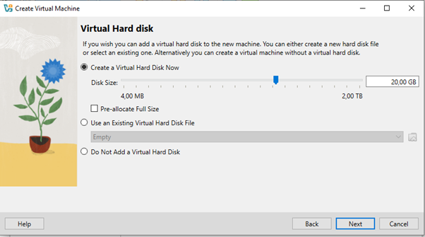

# h1 Oma Linux

## Raportin kirjoittaminen
- Raportin tulee olla tarkka ja toistettavissa
- Raportin tulee olla täsmällinen (sisältää kaikki komennot, valinnat, kellonajat, tarpeeksi kattava kuvaus ongelmasta ja sen korjauksesta)
- Raportin tulee olla helppolukuinen (kirjoitusvirheettömyys, väliotsikot, mahdollinen alkutiivistelmä)
- Raportin tulee sisältää lähdeluettelot ja viittaukset niihin
- Raportti ei saa sisältää plagiointia tai sepitystä (väitteitä tehdyistä toimenpiteistä tai testeistä, joita ei ole tehty)

## Free Software Foundation, neljä vapautta
1.
2.
3.
4.
## Oman Debian on Linux virtuaalikoneen asennus

Onnistunut Oraclen VirtualBox ja Debian 12.9.0 version asennus. Raportti sisältää myös käyttäjätunnuksen luonnissa tapahtuneen virheen ja jatkotoimet.

### HOST-koneen tiedot:

HP ProBook 455R G6

Prosessori:
AMD Ryzen 5 2500U with Radeon Vega Mobile Gfx     2.00 GHz
RAM:
16,0 GB (14,9 GB usable)
GPU:
AMD Radeon(TM) Vega 8 Graphics
Disk/Levy:
SSD

 
 
Asennettu Oracle VirtuaBox ja ladattu Debian 12.9.0 versio koneelle (osoitteesta Debian -- The Universal Operating System).

Käynnistetty VirtualBox ja klikattu välilehteä machine ja new… uuden virtuaalikoneen luomista varten.

 

Annettu tarvittavat käyttöjärjestelmätiedot:

Nimetty kone: OmaLinux

Valittu ISO image: äsken ladattu debian-12.9.0-amd64-netinst.iso

Valittu Next.

Luotu pääkäyttäjätiedot uudelle virtuaalikoneelle:
Username: Joni
Password: (omavalintainen salasana)
Repeat password: (omavalintainen salasana uudestaan)

Ei tehty oletusasetuksiin tässä vaiheessa muutoksia, valittiin Next.

Ei tehty oletusasetuksiin tässä vaiheessa muutoksia, valittiin Next.

 
Yhteenveto ja valittu Next:
 

Virtuaalikone luotu automaattisesti ja käynnistynyt tämän jälkeen valmistuttuaan:

 
Tässä vaiheessa havaittu virhe käyttäjänimessä, eli **username tulee alkaa pienelllä kirjaimella**, joten syötetty kirjautumista varten käyttäjänimi oikeassa muodossa.
Tämän jälkeen kone virtuaalikone asentui ja päivittyi, eikä vaatinut toimenpiteitä tai valintoja, ainoastaan kärsivällisyyttä odottaa asennuksen valmistumista. Asennus itsessään alkoi noin kello 16:25 ja oli kokonaisuudessaan valmis noin kello 16:40.

Asentumisen valmistuttua valittu juuri luotu käyttäjä ja syötetty valittu salasana, jonka jälkeen painettu enter kirjautumista varten:

Alkunäkymä sekä perusasetusten valinta. Valittu kieleksi englanti (US), joka oli oletuksena ja painettu Next:

 
Näppäimistön suomalaista layoutin valintaa varten kirjoitettu hakukenttään finnish ja tarkistettu Prewiev-valintaa painamalla, että näppäimistö täsmää haluttuun.

Suljettu Prewiev näkymä rastista ja klikattu Next.

Annettu oletusasetuksen olla sijainnin suhteen ja klikattu Next.

Vaihtoehtona yhdistää koneeseen oma Google, Nextcloud tai Microsoft-tili. Valitaan Skip tältä erää, saa muutettua myöhemmin tarpeen mukaan.

 
Klikattu nappia Start Using Debian GNU/Linux, jonka jälkeen kone on valmis käytettäväksi. Kone tullut käyttövalmiiksi noin 17:00.

# Lähdeluettelo

Tätä dokumenttia saa kopioida ja muokata GNU General Public License (versio 2 tai uudempi) mukaisesti. (http://www.gnu.org/licenses/gpl.html)
Tero Karvinen, Raportin kirjoittaminen: (https://terokarvinen.com/2006/raportin-kirjoittaminen-4/)
GNU Operating System, hat is Free Software?: (https://www.gnu.org/philosophy/free-sw.html)

 
 

