# h2 Komentaja pingviini

Työn aloitus: 0:00

## Command line basics revisited 
- Peruskomentojen opettelu ulkoa on tärkeää komentorivin tehokkaan käytön vuoksi.
-	Minimum privilige käytännön lähtökohta on antaa niin vähän käyttöoikeuksia käyttäjille kuin se käytön kannalta on mahdollista.
-	Koko järjestelmään vaikuttavat komennot vaativat järjestelmänvalvojan käyttöoikeudet, eli ”sudo”-komennon. Näihin kuuluvat mm. käyttäjien luominen, käyttöoikeuksien muuttaminen ja ohjelmien asennus tai poisto.
-	Käytä tabulatuuria tiedostojen nimien valmiiksi kirjoittamiseen kirjoitusvirheiden välttämiseksi.
-	Käytä nuolinäppäimiä syöttääkseni aiempia komentoja, jottei niitä tarvitse kirjoittaa uudestaan.

Aikaa kulunut 0:45

## a)	Asenna micro

Annoin terminaalissa seuraavat komennot:

`$ sudo apt-get update`

(Terminaali pyysi tässä kohtaa salasananaani ja syötin sen, sekä painon `Enter`, jonka jälkeen komento suoritettiin)

`$ sudo apt install micro`
 
 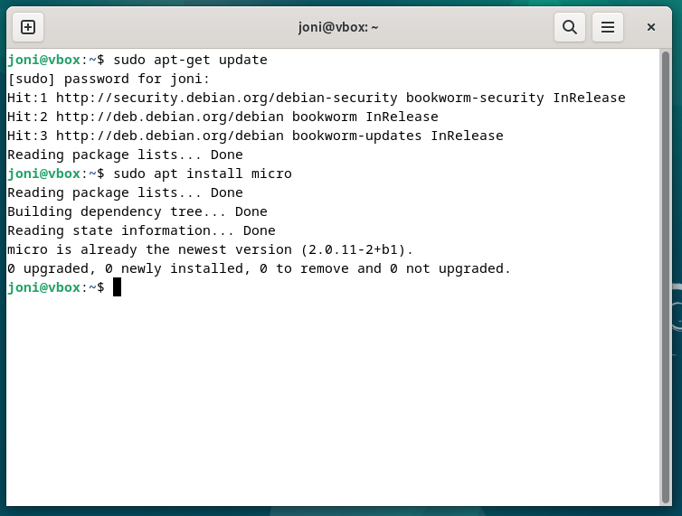

Kulunut aika: 0:50

## b)	Kolme minulle uutta komentoriviohjelmaa

Päätin kokeilla seuraavien komentoriviohjelmien asennusta ja toimintaa:

`nano`: tekstieditori

`rsync`: tiedostojen synkronointityökalu

`tmux`: mahdollistaa siirtymät usean työkalun välillä samassa terminaalissa

Valintaani vaikuttivat kuvaukset, joita löysin hyödylliseksi koettujen ohjelmien joukosta. Kokemusta minulla ei ollut entuudestaan oikein mistään cmd pohjaisesta ohjelmasta linux-ympäristössä, mutta lähdin liikenteeseen avoimen uteliaasti.

Kaikki asennukset suoritin yhdellä komennolla:

`$ sudo apt install nano rsync tmux`

Kulunut aika: 1:45

### Nano

Annoin terminaaliin komennon:

`$nano`

ollessani yhä omassa kotivalikossani.

Komennolla avautui tyhjä tekstitiedosto, johon voi alkaa kirjoittamaan suoraan ilman muita lisävalintoja:

 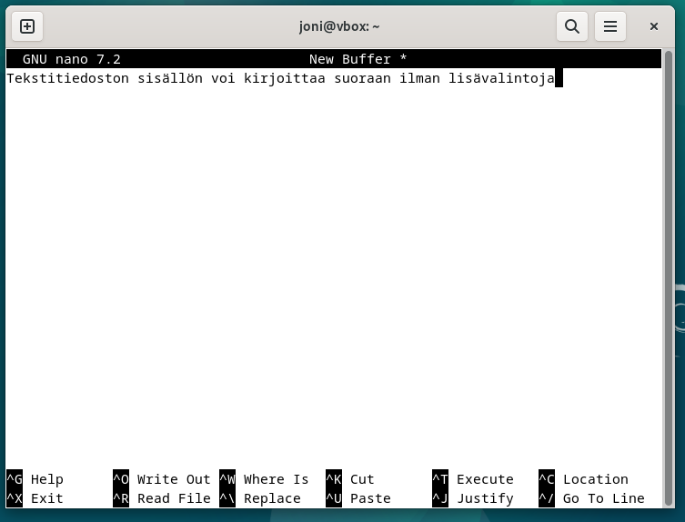

Tiedoston sai tallennettua suoraan painamalla `ctrl + O` (näkymässä alareunassa olevan ohjeen mukaan, koska `^O` tarkoittaa tätä näppäinyhdistelmää).
Tämä siirsi valikon tiedoston nimeämiseen, johon voi kirjoittaa suoraan tiedoston nimen ja vahvistaa tämän painamalla `Enter`.

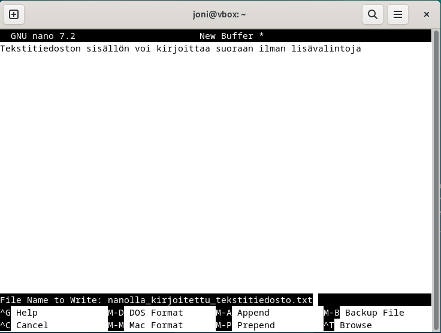

Tallennus tapahtui painamalla `ctrl + X`.

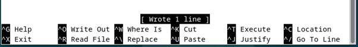

Tekstitiedosto tallentui siihen hakemistoon, jossa olin nanon avaamisen hetkellä. Asian pystyi varmistamaan komennolla:

`$ ls` 

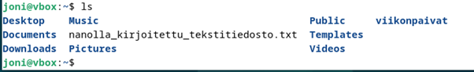

Tiedostoa pääsi muokkaamaan komennolla:

`$ nano nanolla_kirjoitettu_tekstitiedosto.txt`

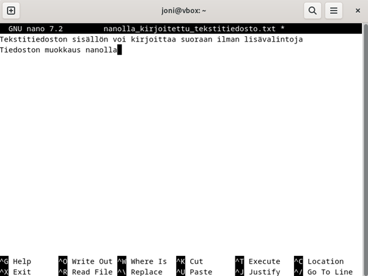

Muokkauksen tallennus tapahtui samaan tapaan kuin alkuperäisen tiedoston luonti seuraavilla komenoilla:

`ctrl + o`

`Enter`

`ctrl + X`

Tekstitiedoston sisällön pystyi tarkistamaan tallentuneen muokattuun muotoon komennolla:

`$ nano nanolla_kirjoitettu_tekstitiedosto.txt`

Ja palaamaan takaisin tekemättä uusia muokkauksia valinnalla `ctrl + X`.

Kulunut aika: 1:15

Lähtiessäni kokeilemaan muita valitsemiani ohjelmia selvisi, että tmux ja rsync eivät olleet järkeviä valintoja sen hetken virtuaalikoneen tiedostomäärälle ja ohjelmamäärälle. En poistanut nätä ohjelmia, koska ajattelin niistä olevan amhdollisesti iloa virtuaalikoneen datamäärän kasvaessa.
Valitsin asennettavaksi näiden tilalle seuraavat uuden tutkinnan jälkeen:

`tree`: luo visuaalisen puumaisen rakenteen hakemistosta ja alihakemistoista

`locate`: hakuohjelma, joka osaa etsiä vastaavuudet hakemistoista

Asensin uudet valitsemani ohjelmat tällä kertaa erillisillä komennoilla:

`$ sudo apt install tree`

`$ sudo apt install locate`

Aikaa kulunut 2:15

### Tree

Tree on tarkoitettu helpottamaan hakemistorakenteen hahmottamista muodostamalla puumaisen kaavan hakemistoista (samaan tapaan kuin esimerkiksi resurssienhallinta GUI versiossa).

Kokeilin tree:n toimintaa komennolla:

`$ tree`

 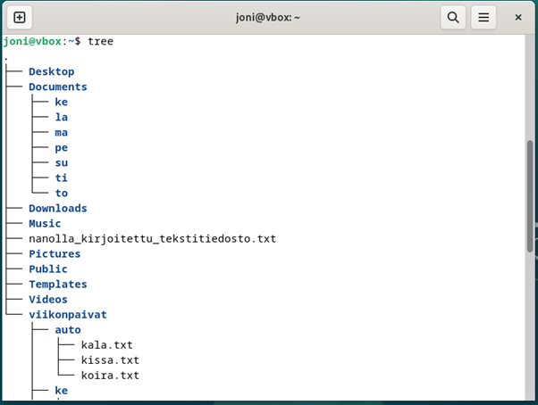

Tree mahdollisti myös määritellä, miten syvälle tiedostorakenteeseen halusi nähdä komennolla:

`$ tree -L 1` 

[ numeron pystyi korvata haluamallaan määrällä ja se määritti hakemistojen tason, jonne asti puu näytti tulokset]

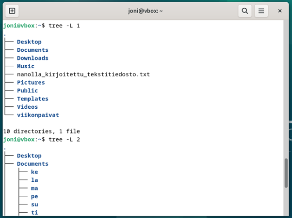 

Tree oli todella positiivinen löytö ja tulen sitä varmasti hyödyntämään jatkossa. Ohjelma on erityisen hyödyllinen, mikäli kansiorakenteen hahmottamisessa on haasteita tai sitä vasta harjoittelee.

Aikaa kulunut 2:30

### Locate

Asennus onnistui komennolla:

`$ sudo apt install locate`

Kokeilin locaten toimintaa komennolla:

`$ locate kissa.txt`

, mutta tämä ei toiminut tehnyt yhtään mitään. Tästä löysin nopeasti tiedon jo samasta lähteestä, että toimiakseen locate vaati myös komennon:

`$ sudo updatedb`

Tämän jälkeen kokeilin uudestaan hakua, tällä kertaa toisella tiedostolla:

`$ locate koira.txt`

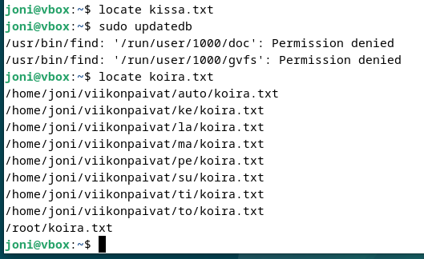
 
Kokeilin toiminnan myös alkuperäisellä kokeilulla:

`$ kissa.txt`

ja ohjelma toimi nyt oikein.

Aikaa kulunut 3:00

## c)	Important directories

### Root-hakemisto (`/`):

Käyttäjäkohtaiseen juurihakemistoon pääsee suoraan kirjoittamalla komennon:

`$ cd /`

Root-käyttäjäksi päästäkseen tulee antaa komento:

`$ sudo su`

Jonka jälkeen syötetään oma salasana ja painetaan `Enter`.
Root-käyttäjyydestä pääsee palaamaan takaisin komennolla:

`$ exit`

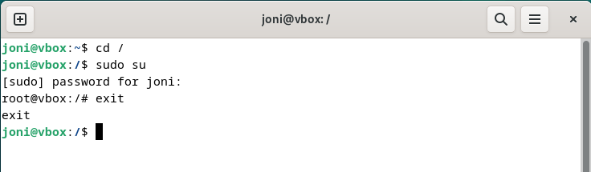

### Kotihakemisto (`/home/`):

Sisältää kaikkien käyttäjien kotihakemistot.
Tietyn käyttäjän kotihakemistoon pääsee (tässä tapauksessa joni-nimisen käyttäjän) seuraavalla komennolla:

`$cd /home/joni`

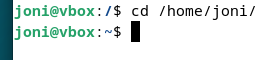

### Järjestelmäasetukset (`/etc/`):

On koko koneen järjestelmän laajuinen ja sisältää asennus ja kokoonpanotiedostoja. Hakemistoon pääsee komennolla:

`$ cd /etc`

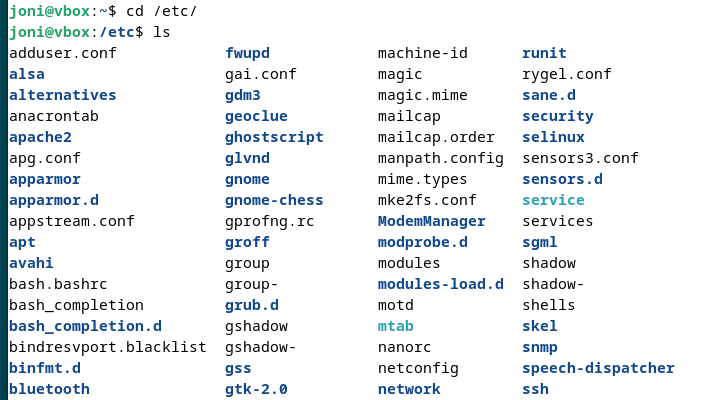

### Siirrettävät mediatiedostot (`/media/`):

Näyttää esimerkiksi USB-tikkujen, ulkoisten kovalevyjen tai muiden ulkoisten tallennuslaitteiden sisällön hakemistona. Hakemistoihin pääsee käsiksi komennolla: 

`$ cd /media`

Ja hakemistosisällön saa katsottua komennolla:

`$ ls`

(Cdrom on ensisijainen viittaus CD- tai DVD-asemaan. Host-koneessa kyseistä asemaa ei ole, mutta oman tutkimiseni mukaan cdrom:in näkyminen johtuu siitä, että virtuaalikoneen asentamiseen on käytetty ISO-tiedostoa, joka käyttäytyy kuin fyysinen CD-levy.)

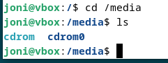

### Järjestelmälokit (/var/log/):

On koko järjestelmän laajuinen hakemisto, josta on mahdollista hakea järjestelmien lokitiedot ja määrittää minkä lokin tiedot haluaa nähtäväksi. Hakemistoon pääsee komennolla:

`$ cd /var/log`

Ja hakemistosisällön saa katsottua komennolla:

`$ ls`

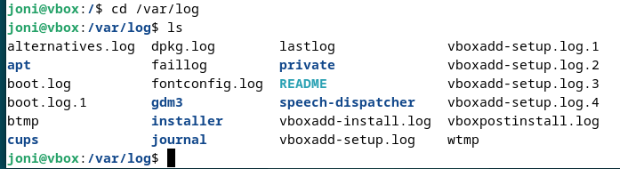

Aikaa kulunut: 3:30

## d) Grep-komento

Grep-komennon tyypillisiä käyttötapoja ovat mm. seuraavat:

Hakuja varten avasin terminaalin ja siirryin oikeaan hakemistoon komennoilla:

`$ cd viikonpaivat` 

`$ cd ma`

Tietyn sanan hakeminen tekstitiedostosta:

`$ grep "koira" koira.txt`

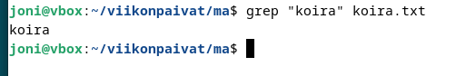

Mikäli haluaa jättää huomioimatta, ovatko kirjaimet isolla vai pienellä kirjoitettuja onnistuu haku seuraavalla komennolla:

`$ grep -i "koira" koira.txt`

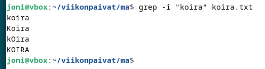

Hakua voi käyttää myös useampaan tiedostoon samassa hakemistossa kerrallaan. Siirryin takaisin ylähakemistoon viikonpaivat komennoilla:

`$ cd ..`

`$ cd ..`

Ylähakemistosta saa haettua kaikkien viikonpaivat alahakemistojen tiedostot ja niiden vastaavuudet kerralla komennolla:

`$ grep -r "koira" viikonpaivat/`

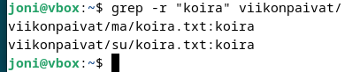

Myös tähän on mahdollista soveltaa ylempänä mainittua `-i` hakua:

`$ grep -r -i "koira" viikonpaivat/`

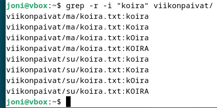

Grep-komennon avulla pystyy myös etimään rivinumerot, joilla hakutulos esiintyy tietyssä tiedostossa:

`$ grep -n "koira" koira.txt`

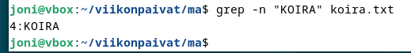

## e) Pipe/putki

Putkella (pipe, `|` ) voi yhdistää toisen komennon tuloksen käytettäväksi seuraavaan komentoon.

Tässä esimerkki, jossa käytetään ensin `grep`-komentoa etsimään hakemistosta (viikonpaivat) tiedostoja, jotka sisältävät hakunan (koira). Saatu tulos käsitellään tämän jälkeen `|` yhdistyksellä ja hakuosumien rivien määrä palautetaan numerona käyttäen komentoa `wc -l`:

`$ grep -r -i "koira" viikonpaivat/ | wc -l`

Aikaa kulunut: 4:00

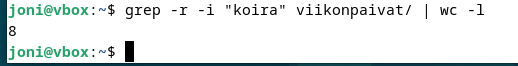
 
## f) Raudan selitys ja analysointi

Tiesin, että koneella ei ollut valmiina asennettua tarvittavaa ohjelmaa, joten asensin sen komennolla:

`$ sudo apt install lshw`

Terminaali pyysi salasanaa ja syötin sen ja painoin Enter.
Ohjelma asentui ja tämän jälkeen annoin komennon:

`$ sudo lshw -short -sanitize`

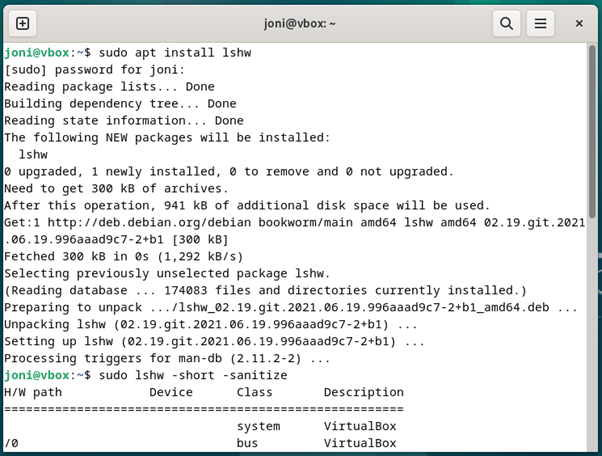

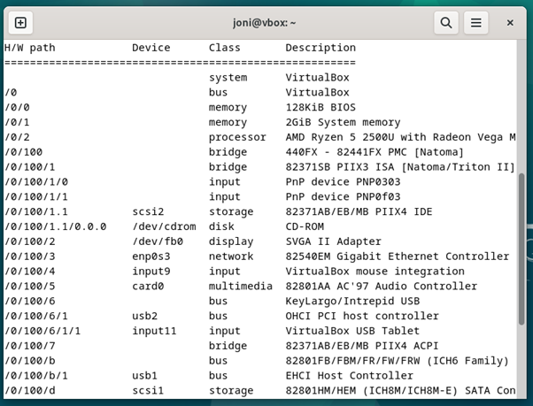

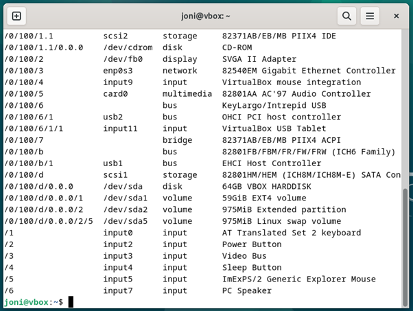

Komento antaa luettelon koneen ominaisuuksista helposti luettavassa muodossa.

Luetteltuna ovat seuraavat:

- H/W path (laiteväylän osoite, eli polku jolla pääset kyseiseen resurssiin)
- Device (laite)
- Class (luokka)
- Description (kuvaus)

Esimerkkipoiminnat:

Virtuaalikone käyttää 941kB muistia asentuessaan. Virtuaalikoneella riittää hyvin resurssit tähän.

Input:it 0, 2, 3, 4, 5 ja 7 kertovat virtuaalikoneen käyttävän kyseisiä komponentteja host-koneesta.

Aikaa kulunut: 4:15

## h) Plug-in asennus micro-editoriin

Yritin asentaa micro-editoriin plug-in:n alla olevan komennon syntaksin mukaisesti (esimerkissä käytin cheat-nimistä plug-in:ia):

`$ micro --plugin install cheat`

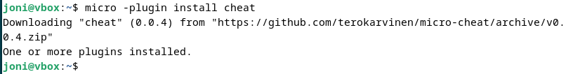

Loin uuden tiedoston microeditorilla komennolla:

`$ micro`

Kirjoitin tiedostoon lyhyen esimerkkikoodin JavaScript-koodista, painoin `ctrl + S` tallenusta varten, annoin tiedostolle nimeksi HelloWorld.js, painoin `Enter`:

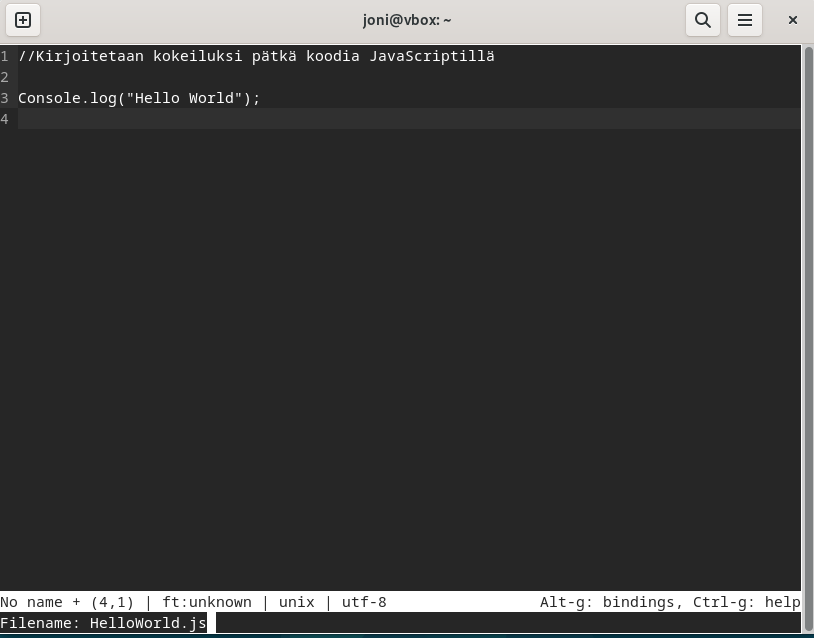

Yritin avata cheat sheet:n painamalla Tero karvisen GitHubin Readme-tiedoston mukaisesti `F1`. Tämä ei toiminut, joten kokeilin myös painaa `fn + F1` saamatta mitään tulosta.
Suljin tiedoston `ctrl + Q`ja tarkistin pug-in:en tilan komennolla:

`$ micro -plugin list`

Huomasin plugin:in asennuksen epäonnistuneen ja plug-in listalla cheat kohdalla oli ilmoitettu versioksi 0.0.0-unknown.

Siirryin Tero Karvisen Readme-tiedoston seuraavaa ohjetta asennukselle (Alternatively, a development install) ja kirjoitin komennon poistaakseni ensin epäonnistuneen asennuksen:

`$ micro -plugin remove cheat`

Seuraavaksi tein Tero Karvisen ohjeen muakiset komennot:

`$ cd $HOME/.config/micro/plug/`

`$ git clone https://github.com/terokarvinen/micro-cheat`

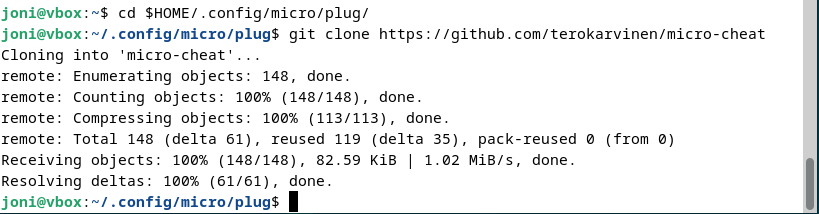

Palasin takaisin hakemistoon, jossa tekemäni JavaScript-tiedosto oli komennoilla:

`$ cd ..`

`$ cd ..`

`$ cd ..`

Annoin komennon:

`$ micro HelloWorld.js`

ja painoin `Enter`. Päästyäni takaisin microssa HelloWorld.js tiedostoon painoin `fn + F1` ja sain esille onnistuneesti cheat sheet:n (riippuen näppäinasetuksista pelkkä F1 voi toimia):

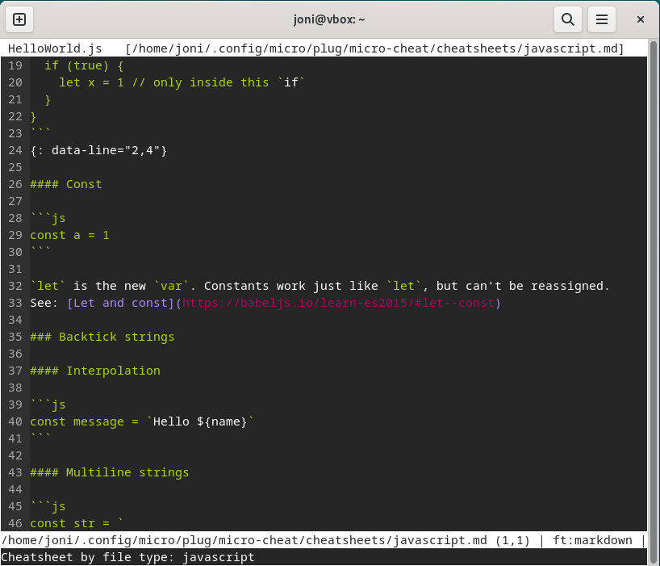

Suljin cheat sheetin `ctrl + Q`

Aikaa kulunut: 5:00

## Lähdeluettelo

-	Tero Karvinen, Command Line Basics Revisited: [Command line basics revisited](https://terokarvinen.com/2020/command-line-basics-revisited/?fromSearch=command%20line%20basics%20revisited)

-	ITsfoss: [Micro editor cheat sheet](https://itsfoss.com/content/images/wordpress/2022/08/micro-command-line-text-editor-cheat-sheet.pdf)

-	Tero Karvinen GitHub: [Cheat plug-in](https://github.com/terokarvinen/micro-cheat)

- GitHub: [Basic writing and formatting syntax](https://docs.github.com/en/get-started/writing-on-github/getting-started-with-writing-and-formatting-on-github/basic-writing-and-formatting-syntax)

## Tekijä

### Joni Laine

### Haaga-Helia, IT-Tradenomiopiskelija

