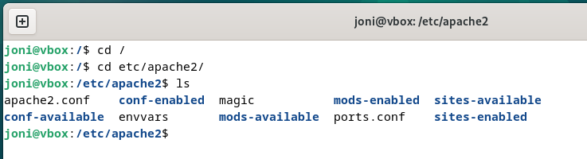
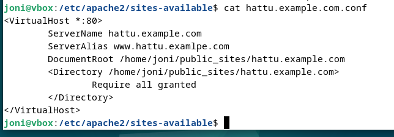
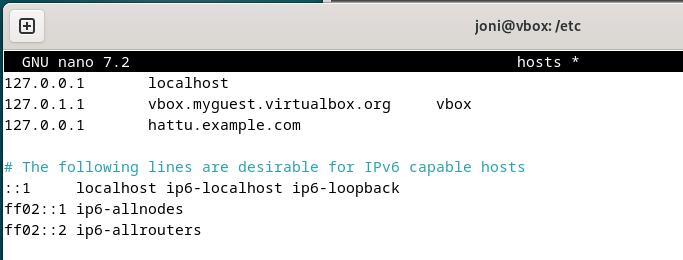

# h3 Hello Web Server

Aikaa kulunut: 0:00

## Weppipalvelin localhost-osoitteessa ja Apache

Apache-weppipalvelin oli valmiina asennettuna koneelle.
Testasin weppipalvelimen vastaamisen terminaalissa komennolla:

´$systemctl restart apache2´

Komento promptasi salasanan syöttöruudun, johon annoin salasanan ja painoin `Enter`.

Kokeilin sivun vastaamisen Firefox-selaimella osoitteella http://localhost sekä https://127.0.0.1

 
 
 

Aikaa kulunut: 0:05

## Loki weppipalvelimella olevan sivun lataamisesta:

Latasin sivustoni kaksi kertaa uudestaan Firefox-selaimessa.
Palasin terminaaliin ja varmistin olevasi kotihakemistossa komennoilla:

`$ cd /`

`$ pwd`

Yritin lukea lokit seuraavalla komennolla:

`$sudo tail -3 var/log/apache2/access.log`

Komento ei antanut ollenkaan tuloksia. Tarkistin muut lokivaihtoehdot komennolla:

`$ sudo ls var/log/apache2`

 

 Kokeilin lokia other_vhosts_access.logia (koska access.log.1 ja other_vhosts_access.log.1 ovat vanhemmat lokit/historia):

`$ sudo tail -3 var/log/apache2/other_vhosts_access.log`

 

Komento antoi toivotusti kolme viimeistä lokia nähtäville.

Aikaa kulunut: 0:20

## Nimipohjainen - vs. IP-pohjainen virtuaali-isäntä (host)

-	IP-pohjaiset virtuaali hostit määrittävät virtuaali-isännän IP-osoitteen avulla ja tarvitsevat siksi oman IP:n jokaisella hostille
-	Nimi-pohjainen virtuaali host saa clientilta http-otsikon mahdollistaen näin useamman hostin jakaa saman IP:n
-	Nimipohjainen virtuaali hosting on ensisijaisesti käytettävä tapa nykyään ja helpommin hallinnoitava ja sitä tulisi suosia myös rajallisten IP-osoitteiden vuoksi, ellei IP-pohjainen virtuaali hostaus ole ehdotonta esimerkiksi laitekannan vuoksi
  
## Miten palvelin valitsee oikean virtuaali-isännän
-	Nimipohjainen virtuaali-isäntä rajaa ensin osuvimman IP-osoitteen ja etsii sitten sopivimman virtuaali-isännän
-	Ollessa useampi nimipohjainen isäntä samalla osoitteella ja portilla, jatkuu tarkimman osuman hakeminen ServerNamella ja ServerAliaksella, jos jälkeen mainituista ei löydy osumaa, käytetään ensimmäistä osumaa löydetyltä virtuaali-isäntien listalta
  
## Nimipohjaisten virtuaali-isäntien käyttö
-	Jokainen virtuaali-isäntä -lohko (`<VirtualHost>` ) tarvitsee ServerNamen ja DocumentRootin (vähimmäisvaatimus)
-	Oletusvirtuaali-isäntä on järkevää luoda, kun olemassa olevaan palvelimeen luodaan uusia virtuaali-isäntiä, joilla käytetään samaa konfiguraatiota
-	ServerName periytyy peruspalvelimen konfiguraatiosta, mikäli sitä ei ole erikseen määritelty virtuaali-isännälle, tämän vuoksi se on aina syytä tehdä parhaan resoluution saavuttamiseksi
-	Parempien osuvuuksien saamiseksi erilaisilla sivuston kirjoitusasuilla, tulee tehdä muutokset sekä DNS-palvelimelle että ServerName tai ServerAliakseksi
-	Nimipohjaisten virtuaali-isäntien avulla on mahdollista ei ainoastaan olla monta weppisivua saman IP-osoitteen takana vaan myös useampia domaineja

Aikaa kulunut: 1:10

## Lokin analyysi:

 

Analysoidaan yksi rivi, joka on muodostunut yhdestä weppisivun latauksesta. Tässä tapauksessa tarkastellaan siis kahta alinta riviä komennon antamasta vastauksesta:
  
`sivu.example.com:80 127.0.0.1 - - [30/jan/2025:18:59:33 +0200] "GET  / HTTP/1.1" 304 247 "-" "Mozilla/5.0 (X11; Linux x86_64; rv:128.0) Gecko/20100101 Firefox/128.0"`

#### sivu.example.com

Palvelimen nimi.

#### 80

Palvelimen portti, johon pyyntö lähetetään. Kyseinen portti 80, on tarkoitettu erityisesti http-liikenteelle ja on kyseistä protokollaa käyttävän liikenteen oletusportti.

#### 127.0.0.1

Palvelimelle pyynnön tehneen clientin IP-osoite (127.0.0.1 viittaa samaan laitteeseen kuin missä palvelin sijaitsee).

#### [30/jan/2025:18:59:33 +0200]

Pyynnön tekoaika (30. tammikuuta 2025; kello 18:59:33 UTC +2).

#### GET  / HTTP/1.1

GET-tyypin http-pyyntö sivun juurisivulle (`/`); http-versio (`1.1`). GET on hakupyyntö, eli pyytää tietoja palvelimelta. Tässä tapauksessa weppisivua ja sen sisältöä.

#### 304 

Vastauskoodi pyyntöön. Saatu vastauskoodi 304 tarkoittaa, että sisällössä ei ole muutosta viimeisimpään pyyntöön nähtynä.

#### 247

Vastauksen koko tavuina(B).

#### -

Viittauslähde, joka on tyhjä tässä tapauksessa. Arvona olisi voinut olla esimerkiksi https://google.com, jos pyynnön tekijä siirtyi sivustolle sen sivuston linkkiä käyttämällä.

#### Mozilla/5.0 (X11; Linux x86_64; rv:128.0) Gecko/20100101 Firefox/128.0

Käyttäjäagentin jälki (User Agent), joka tässä tapauksessa kertoo pyynnön olevan tehty Linux OS:llä (Linux x86_64) ja käyttäen Firefox-selainta (Firefox/128.0), sekä kummankin versiot. Rivin alun Mozilla/5.0 viittaa Mozilla-selaimeen, joka on nykyään tunnettu nimeltään Firefox.
X11 viittaa Unix-pohjaiseen OS:ään, joka on tässä tapauksessa Linux. Rv:128.0 on selaimen versio, joka mainitaan myös jäljen käyttäjäagentin antamassa päätteessä toistamiseen. Gecko/20100101, kertoo kyseessä olevan Mozillan kehittämästä Gecko renderöintimoottorista, joka pystyy mm. verkkosivujen näyttämiseen; 20100101 on tämän kyseisen Geckon versionumero.

Aikaa kulunut: 1:50

## Uusi etusivu hattu.example.com

Siirryin hakemistoo, `public_sites` ja loin tarvittavan hakemiston komennnolla:

`$ cd mkdir hattu.example.com`

 

 Ja tarkistin käyttöikeudet käyttäjälle joni:

  

Tein seuraavat komennot:

`$ cd /`

`$ cd etc/apache2/`

Tarkistin kansioiden nimet:

`$ cd ls`

Ja siirryin tarvitsemaani sijaintiin:

`$ cd sites-enabled`

Ja suljin aiemman sivuston:

`$  sudo a2dissite sivu.example.com.conf`

Käynnistin Apachen uudestaan:

`$ cd systemctl restart apache2`

  

Loin hattu.example.com.conf tiedoston komennolla:

`$ cd nano hattu.example.com.conf`

  

Tein komennot tallentaakseni ja sulkeakseni tiedoston:

`ctrl + O` 
`Enter` 
`ctrl + X`

Aktivoin hattu.example.com sivun ja käynnistin Apachen uudestaan:

`$ cd sudo a2ensute hattu.example.com`

`$ cd sudo systemctl restart apache2`

  

Siirryin takaisin juurivalikkoon ja menin tarkistamaan public_sites kansion tilanteen:

`$ cd home/joni`

`$ cd public_sites`

`$ ls`

 

Tarkistin varmuudeksi, että vanha sivu oli epäaktivoitu ja uusi aktivoitu:

 

Seuraavaksi siirryin kirjoittamaan sisällön hattu.example.com tiedostoon:

`$ cd`

`$ cd etc/apache2/`

`$ nano hattu.examle.com`

Valitsin Virtuaalikoneen välilehdeltä Devices > Shared clipboard > Host To Guest, koska olin kirjoittanut hattu.example.com sivulle HTML5 scriptin, jonka olin testannut käyttäen validaattoria https://validator.w3.org/, ja kopioin tekstin host-koneelta hatty.example.com tiedostoon virtuaalikoneelle.

Annoin seuraavat komennot tallentaakseni ja sulkeakseni tiedoston ja käynnistin Apachen uudestaan:

`ctrl + O`

`Enter`

`ctrl + X`

`$ systemctl restart apache2`

Latasin Firefox-selaimen http://localhost sivun uudelleen ja sain seuraavan virheen:

Menin tarkistamaan virhelokin sisällön:

`$ cd /`

`$ cd var/ log`

`$ sudo tail -1 apache2/error.log`

Huomasin, että index.html ei ollut määritelty ja että myös hattu.example.com.conf tiedosto oli tyhjä.
Tein komennon päästäkseni antamaan tarvittavat tiedot hattu.example.com.conf tiedostolle:

`$ sudo nano /etc/apache2/hattu.example.com.conf`

 Lisäsin tiedostoon sisällöksi:

 

Annoin seuraavat komennot tallentaakseni ja sulkeakseni tiedoston:

`ctrl + O`

`Enter`

`ctrl + X`

Siirryin hattu.example.com kansioon seuraavilla komennoilla:

`$ cd /`

`$ cd public_sites`

`$ cd hattu.example.com`

`$ nano index.html`

ja annoin tiedostolle haluamani HTML-sisällön:

 

Annoin seuraavat komennot tallentaakseni ja sulkeakseni tiedoston:

`ctrl + O`

`Enter`

`ctrl + X`

Sain seuraavan vriheen ladattuani selaimella sivun uudestaan:

 

Menin tarkistamaan jälleeen virhelokin:

`$ cd /`

`$  cd var/log/`

`$ sudo tail -1 apache2/error.log`

 

En ollut täysin varma, mitä kyseinen virhe tarkoitti, joten kävin läpi aiemmin tekemäni vaiheet, joissa huomasin kirjoitusvirheen tiedostossa hattu.example.com.conf ja kävin korjaamassa tämän. Vian syy ei ollut kyseinen virhe, mutta korjasin tämän kuitenkin, kun sen huomasin.

Siirryin seuraavaksi korjaamaan hosts-tiedoston sisällön viittaamaan oiekaan sivuun:

`$ cd /`
 
`$ cd /etc/`

`$ sudo nano hosts`

Vaihdoin uuden URL:in tiedostoon:

Käynnistin Apachen uudestaan:

`$ systemctl restart apache2`

Ja latasin Firefox-selaimessa sivun uudestaan. Sivu ei edelleenkään toiminut vaan antoi samaa virhettä.
Luin jälleen Apachen errron.login, mutta se ei valitettvasti tuottanut juurikaan iloa, enkä löytänyt syytä virheelle.

Kokeilin tässä vaiheessa huvikseni kokeilla siirtyä selaimessa suoraan sivulle http://hattu.example.com ja huomasin sen toimivan oikein:

## Lähdeluettelo

- Apache HTTP Server Project, Name based virtual host support: Name-based Virtual Host Support - Apache HTTP Server Version 2.4
-	Karvinen 2018: Name Based Virtual Hosts on Apache – Multiple Websites to Single IP Address
