# h4 Maailma tulee

Aikaa kulunut: 0:00

##	x) Lue ja tiivistä. Tiivistelmäksi riittää muutama ranskalainen viiva per artikkeli. 

Aikaa kulunut: 0:00

##	a) Oman virtuaalipalvelimen vuokraus

##	c) Asenna weppipalvelin omalle virtuaalipalvelimellesi. Korvaa testisivu. Kokeile, että se näkyy julkisesti. Kokeile myös eri koneelta, esim kännykältä. (Jos haluat tehdä oikeat weppisivut, tarvitset Name Based Virtual Hostin)

Valitsin näkymästä ensimmäisenä Start Free Trial ja annoin sinne pyydetyt omat tiedot. Tämän jälkeen UpCloud lähetti vahvistuskoodin sähköpostiini ja kävin vahvistamassa tämän ja loin tunnuksen.
Kirjauduin palveluun juuri luomillani tunnuksilla.

 

Valitsin verify account ja täytin tarvittavat tiedot luottokortin (tai debit-kortin) rekisteröintiä varten ja vahvistin tiedot.

 
 
Valitsin Deploy now ja Server.

 

Serverin sijainniksi valitsin FI-HEL1 (Suomesta).

 

Plan valinnassa otin valinnan:
1CPU core, 1GB memory, 10GB Storage, 3€ Price/month
Käyttöjärjestelmäksi valitsin Debian GNU/Linux 12 (Bookworm)

 

Mainitsematta jätetyille valinnoille en tehnyt muutoksia, koska näille ei ollut tarvetta.
Siirryin SSH-avaimen luomiseen ja virtuaalikoneelle.

Siirryin public-sites -kansioon ja syötin komennot:

`$  sudo apt-get install openssh-client`

`Enter`

`$ ssh-keygen`

`Enter`

Terminaali pyytä luomaan salasanan, mutta tämän ohitin jättämällä ne tyhjiksi Enterillä.
Tämän jälkeen avain ja avaimen randomart-kuva generoitiin automaattisesti.

 
 
Valitsin Login Method kohdasta SSH keys:

 
 
Palasin virtuaali koneella juureen ja siirryin ssh-kansion sisältöön komennoilla:

`$ cd /home/joni/`

`$ cd .ssh`

`$ls`

 
 
Käytin komentoa:

`$ Cat id_rsa.pub`

Ja kopioin saadun julkisen avaimen.

 

Palasin UpCloudin puolelle ja liitin julkisen avaimen Add an SSH key näkymään:

 
 
Ja valitsin Save he SSH key.
Klikkasin Deploy ja odotin, että serveri valmistuu.

 

Odottaessa siirryin jo valmiiksi virtuaalikoneella oikeaan sijaintiin ja varmistin sijaintini komennoilla:

`$ cd`

`$ pwd`

`$  ls`

 

Serverin valmistuttua (vei noin 3 minuuttia) klikkasin kuvan mukaista See how to connect linkkiä:

 

Ja seurasin ohjeita linkin takana valitsemalla ohjeeksi virtuaalikoneeni käyttöjärjestelmälle sopivan ohjeen (from linux):

 

Eteeni tuli varmistus, haluanko varmasti yhdistää ja jatkaa. Tarkistin IP-osoitteen ja kirjoitin komentoriville `yes` ja painoin `Enter`

 
 
Ja lopuksi valitsin `Y` ja `Enter`

Aikaa kulunut: 0:45

##	b) Tee alkutoimet omalla virtuaalipalvelimellasi: tulimuuri päälle, root-tunnus kiinni, ohjelmien päivitys.

Lisäsin käyttäjän joni sudo-ryhmään komennoilla:

`$ sudo adduser joni sudo`

`Enter`

Ja kirjauduin pois root-käyttäjältä komennolla:

`$exit`

Yritin saada SSH yhteyden komennolla, mutta tämä ei näyttänyt onnistuvan toivotusti ja palautti käyttäjäksi root-käyttäjän:

`$ ssh joni@94.237.36.30`

 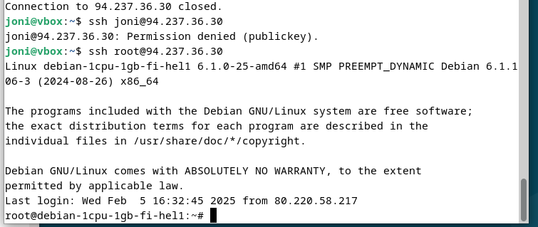

 Päätin kokeilla miltä SSH:n tilanne näytti root-käyttäjän kautta komennolla:

 `$ ssh root@94.237.36.30`
 
 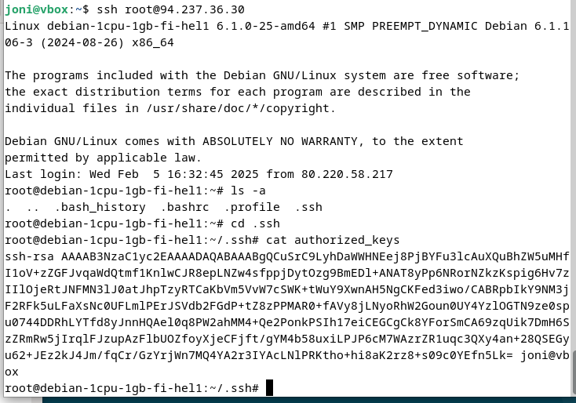

 Rootin puolella kokeiltaessa ssh-avain löytyi.

 Palasin root-tasolle komennolla:

`$ cd`

Ja käytttöoikeustasot seuraavasti:

(Huom: tämä oli ilmeisesti tarpeeton komento tähän väliin, joten tätä ei tarvitse tehdä: `$ cp -n -r /root/.ssh /home/joni/`)

`$ cd /home/joni/`

`$ ls -la`

 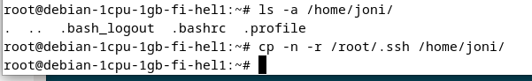

 Huomasin, että käyttäjällä joni ei ollut tarvittavia oikeuksia .ssh:n puolelle, joten lisäsin nämä komennolla:

 `$ chown joni:joni .ssh -R`
 
 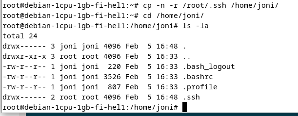

Ja tarkistin käyttöoikeuksien muuttuneen oikein:

`$ ls -la`
 
 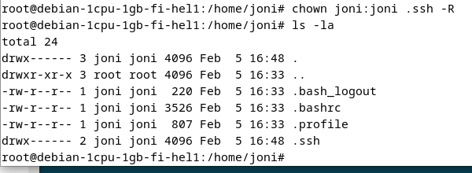

 Suljin root-yhteyden komennolla:

`$ exit`

`Enter`

Ja kokeilin käyttäjän joni kautta yhetyden muodostamista uudestaan:

`$ ssh joni@94.237.36.30`
     
 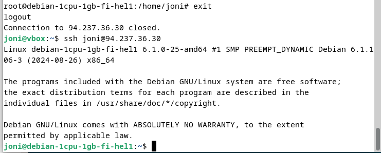

Annoin saman komennon toistamiseen ja sain kuvan mukaisen virheen. Aloin epäillä, että annetun virheen lisäksi sudo-oikeudet eivät ehkä ole kuitenkaan kunnossa, jotta voisin poistaa root-käyttäjän, joten tein testin asiasta käyttämällä `echo sudo` -komentoa:

`$ ssh joni@94.237.36.30`

`$ echo sudo testi`

Tämä plajasti, että luomani salasana oli ilmeisesti liian hvyä, koska en enää itsekään osannut kirjoittaa sitä oikein.
 
 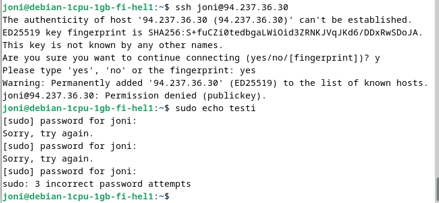

 Palasin jälleen root-puolelle komennolla:

 `$ ssh root@94.237.36.30`

 Ja vaihdoin joni käyttäjän salasanan (tämä vaati lukituksen avaamista, koska epäonnistuneita kertoja oli kolme):

`$ passwd -u joni`

Ja syötin uuden salasanan kahdesti sekä kirjauduin ulos root-puolelta:

`$ exit`

 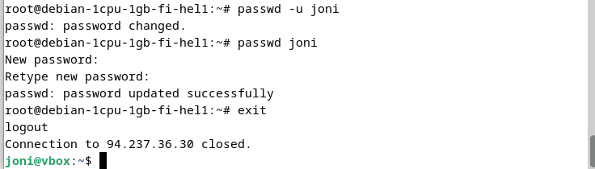

 Annoin uudestaan komennon:

`$ ssh joni@94.237.36.30`

Ja syötin uuden testin sudo-oikeuksien tarkistamiseksi:

`$ echo sudo testi2`

Jonka jälkeen syötin uuden salasanani ja sain toivotun tuloksen:
 
 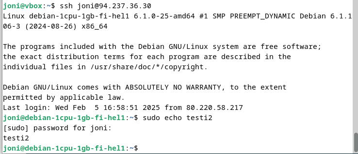

Varmistettuani sudo-oikeuksien olevan kunnossa lukitsin root-käyttäjän tunnukset ja suljin yhteyden:

`$ sudo usermod --lock root`

`$ exit`

 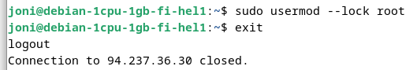

 ???

  

Tarkistin tässä kohtaa virtuaalipalvelimen nimen komennolla:

(Tämä vaihe osoittautui turhaksi tältä erää: `$ sudo rm /root/.ssh -r`)

`$ hostname`

 Ja päivitin kaikki ohjelmat:

`$ sudo apt-get update`
 
 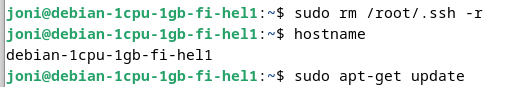

 ???
 
 

Annoin komennon:

`$ sudo ufw allow`

Ja annoin valinnan `Y` kysyttäessä jatkotoimista.

ja tämän jälkeen seuraavat komennot:

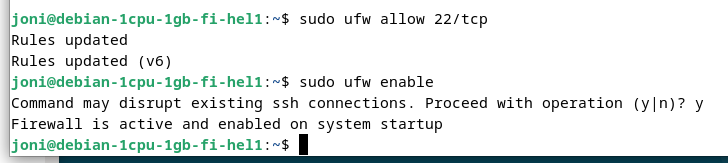

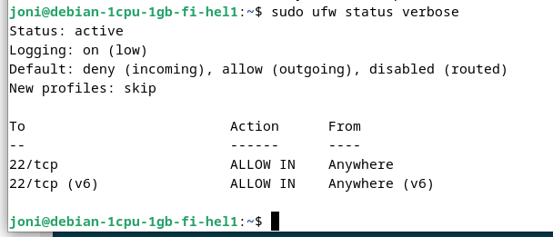

`$ sudo apt-get install unattended`

Tämä ei mennyt läpi odotetusti. JOten annoin komennot:

`$ sudo apt-get install apache2`

`$ sudo apt-get install bash-completion`

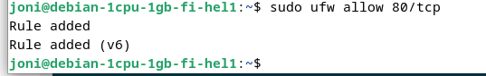

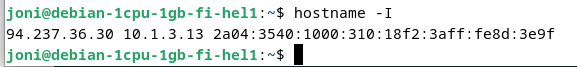

Kokeilin sivun toimivuutta IP-osoitteessa 94.237.36.30 ja sain näkyviin Apachen oletus (default) sivun:

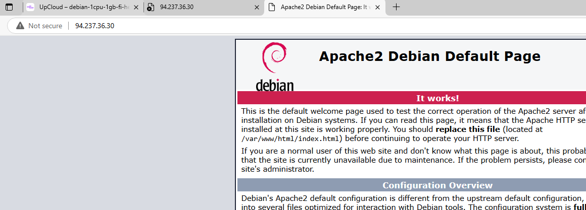

Aikaa kulunut: 2:30

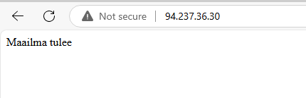

## Lähdeluettelo

