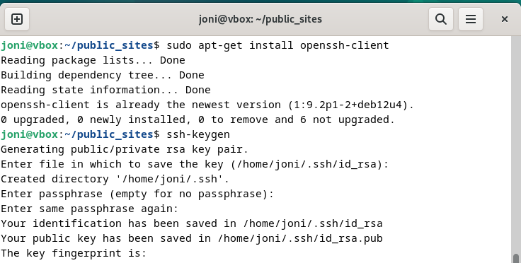

# h4 Maailma tulee

Aikaa kulunut: 0:00

##	x) Lue ja tiivistä. Tiivistelmäksi riittää muutama ranskalainen viiva per artikkeli. 

Aikaa kulunut: 0:00

##	a) Oman virtuaalipalvelimen vuokraus

Valitsin näkymästä ensimmäisenä Start Free Trial ja annoin sinne pyydetyt omat tiedot. Tämän jälkeen UpCloud lähetti vahvistuskoodin sähköpostiini ja kävin vahvistamassa tämän ja loin tunnuksen.
Kirjauduin palveluun juuri luomillani tunnuksilla.

 

Valitsin verify account ja täytin tarvittavat tiedot luottokortin (tai debit-kortin) rekisteröintiä varten ja vahvistin tiedot.

 
 
Valitsin Deploy now ja Server.

 

Serverin sijainniksi valitsin FI-HEL1 (Suomesta).

 

Plan valinnassa otin valinnan:
1CPU core, 1GB memory, 10GB Storage, 3€ Price/month
Käyttöjärjestelmäksi valitsin Debian GNU/Linux 12 (Bookworm)

 

Mainitsematta jätetyille valinnoille en tehnyt muutoksia, koska näille ei ollut tarvetta.
Siirryin SSH-avaimen luomiseen ja virtuaalikoneelle.

Siirryin public-sites -kansioon ja syötin komennot:

`$  sudo apt-get install openssh-client`

`Enter`

`$ ssh-keygen`

`Enter`

Terminaali pyytä luomaan salasanan, mutta tämän ohitin jättämällä ne tyhjiksi Enterillä.
Tämän jälkeen avain ja avaimen randomart-kuva generoitiin automaattisesti.

 
 
Valitsin Login Method kohdasta SSH keys:

 
 
Palasin virtuaali koneella juureen ja siirryin ssh-kansion sisältöön komennoilla:

`$ cd /home/joni/`

`$ cd .ssh`

`$ls`

 
 
Käytin komentoa:

`$ Cat id_rsa.pub`

Ja kopioin saadun julkisen avaimen.

 

Palasin UpCloudin puolelle ja liitin julkisen avaimen Add an SSH key näkymään:

 
 
Ja valitsin Save he SSH key.
Klikkasin Deploy ja odotin, että serveri valmistuu.

 

Odottaessa siirryin jo valmiiksi virtuaalikoneella oikeaan sijaintiin ja varmistin sijaintini komennoilla:

`$ cd`

`$ pwd`

`$  ls`

 

Serverin valmistuttua (vei noin 3 minuuttia) klikkasin kuvan mukaista See how to connect linkkiä:

 

Ja seurasin ohjeita linkin takana valitsemalla ohjeeksi virtuaalikoneeni käyttöjärjestelmälle sopivan ohjeen (from linux):

 

Eteeni tuli varmistus, haluanko varmasti yhdistää ja jatkaa. Tarkistin IP-osoitteen ja kirjoitin komentoriville `yes` ja painoin `Enter`

 
 
Ja lopuksi valitsin `Y` ja `Enter`

Lisäsin käyttäjän vielä sudo-ryhmään:

`$ sudo adduser joni sudo`

`Enter`

Ja kirjauduin pois root-käyttäjältä:

`$exit`

Aikaa kulunut: 0:00

