# h5 Nimekäs

## 	a) Julkinen nimi osoittamaan omaan koneeseen

Käytin oman domain-nimen hankintaan NameCheap-palvelua. Valitsin vapaan nimen ikonlainen.com ja lisäsin NameCheapin portaalissa kaksi A-tietuetta (`@`, eli juuri, sekä `www`, joka osoitti samaan IP-osoitteeseen kuin `@`-tietue). Käytetty IP-osoite, oli aiemmassa h4-tehtävässä toteuttamani IP varaamallani palvelimella.

Domainin DNS-tietueet näiden lisäysten jälkeen:

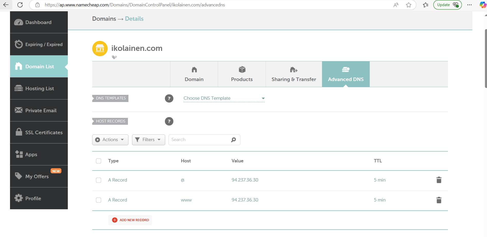

Vahvistin antamani yhteystiedot uudella domainilla NameCheapissa vaatimuksen mukaisesti. Tähän vaiheeseen pääsi helposti seuraamalla NameCheap-portaalin antamaa ilmoitusta seuraamalla.

A-tietueiden lisäämisen jälkeen oli juuri luomani domain ohjattu näyttämään aiemmin virtuaalikoneella luomani index.html ja ohjaus toimi sekä <ikolainen.com>, että www.ikolainen.com osoitteilla:

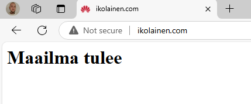

## b) Name Based Virtual Host näkyville uudessa nimessä

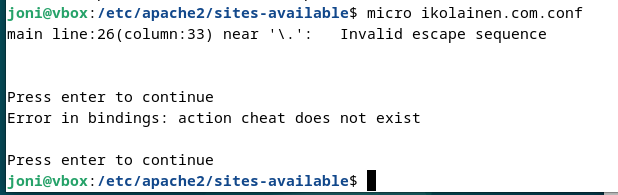

Lisätty sisältö sivustolle:

KUVA PUUTTUU!

ikolainen.com.conf tiedoston luonti ja sisällön muokkaus:

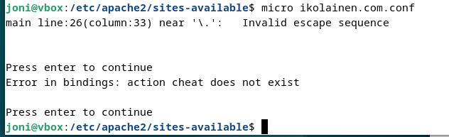

ikolainen.com.conf tiedoston sisällöksi laitettu:

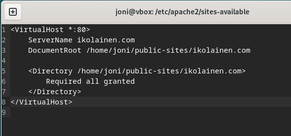

luodaan kotihakemistoon ikolainen.com:

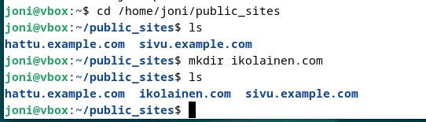

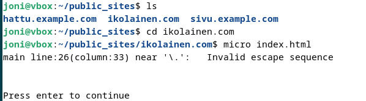

Ja sinne sisältöä:

KUVA PUUTTUU!

Siirryin takaisin SSH-yhteyteen ja muokkasin ikolainen.com.conf tiedostoa komennolla:

`$ sudoedit /etc/apache2/sites-available/ikolainen.com.conf`

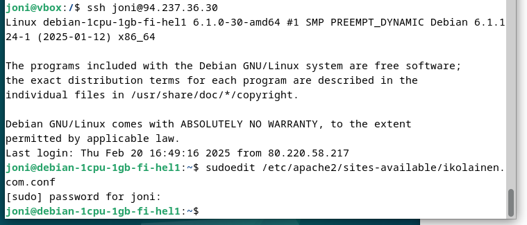

```
<VirtualHost *:80>
  ServerName ikolainen.com
  ServerAlias www.ikolainen.com
  DocumentRoot /home/joni/public_sites/ikolainen.com
  <Directory /home/joni/public_sites/ikolainen.com>
    Require all granted
  </Directory>
</VirtualHost>
```

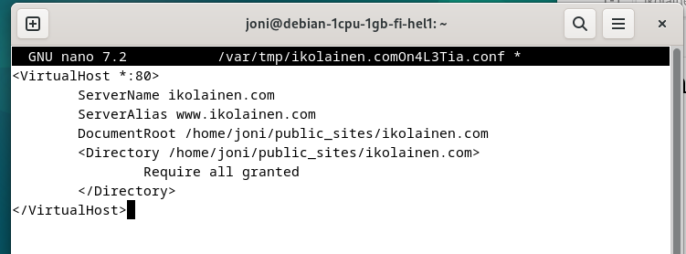

Tallensin ja suljin tiedoston valinnoilla  `citrl`+ `S` ja `ctrl` + `Q`.

Aktivoin conf-tiedoston käyttöön komennolla:

`$ sudo a2ensite ikolainen.com.conf`

Ja käynnistyn Apachen uudestaan:

`$ sudo systemctl restart apache2`

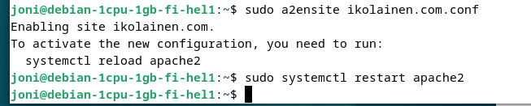

Päivitin selaimen pitämällä `shift`-painiketta pohjassa ja sain seuraavan tuloksen:

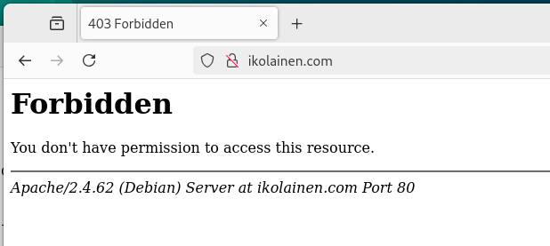

Siirryin terminaalissa tarkistamaan, oliko oikea conf-tiedosto varmasti aktivoituna:

`$ ls /etc/apache2/sites-enabled`

Huomasin, että myös 000-default.conf oli yhä aktiivisena, joten suljin sen ja käynnistin Apachen uudestaan (unohdin ensimmäisellä yrittämällä käyttää komennossa sudo, ennen Apachen uudelleen käynnistämistä):

`$ sudo a2dissite 000-default.conf`

`$ sudo systemctl restart apache2`

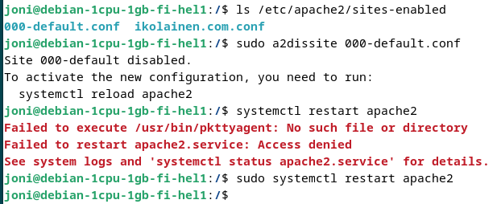

Tällä ei ollut kuitenkaan vaikutusta sivuston käyttäytymiseen vaan sain yhä saman `403 Forbidden` virheen.

Olin kokeillut sivun uudelleen lataamsiat useammalla laitteella, joten päätin tarkistaa virhelokin sisällön komennolla:

`$ sudo tail -f /var/log/apache2/error.log`

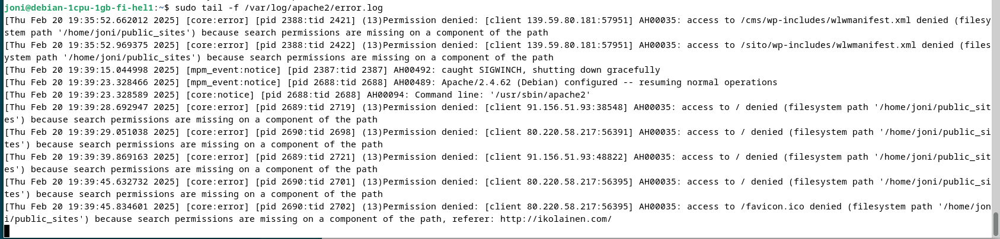

Huomasin virheen viittaavan tiedostopolussa olevaan käyttöoikeusongelmaan.

`-- search permissions are missing on a component of the path, refer: hhtp://ikolainen.com/`

Palasin terminaaliin ja päätin tarkistaa, onko käyttäjällä `joni` tarvittavat oikeudet kunnossa:

`$ namei -l /home/joni/publics-sites/`

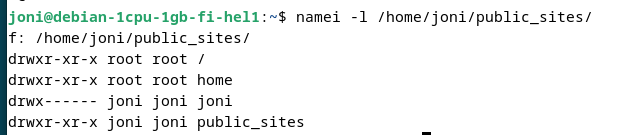

Huomasin käyttöoikeuksissa puutteen, joka on todennäköisesti aiheuttanut haasteita myös aiemmin käyttäjän kanssa ja aiheuttanut muun muassa salasanan kanssa ilmenneen ongelman aiemmassa osiossa h4.

Käyttäjällä `joni` ei ollut tarvittavia oikeuksia:

oikeuksien olisi tullut sallia myös luku ja suoritus ryhmälle (group) ja suoritus kaikille (tässä tapauksessa oikeuden puuttuminen esti Apachelta tiedoston suorittamisen).

Korjasin käyttöoikeudet komennolla:

`$ sudo chmod 755 /home/joni`

sekä varmuudeksi myös:

`$ sudo chmod 755 /home/joni/public_sites`

ja tarkistin lopuksi käyttöoikeuksien korjaantuneen toivotusti:

`$ namei -l /home/joni/public_sites`

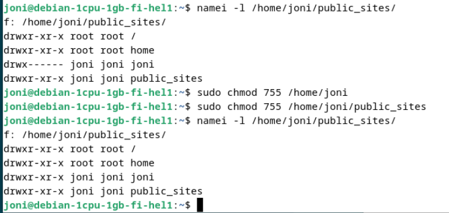

Käynnistin Apachen uudestaan ja päivitin selaimen pitäen `shift`-näppäintä pohjassa, jonka jälkeen sivusto toimi toivotusti:

`$ sudo systemctl restart apache2`

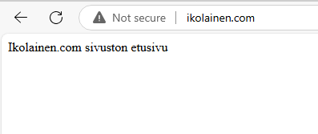

## c) Alasivujen luonti ja muokkaus näkyville nimellä

## d) Alidomainien luonti omalle nimelle

Menin takaisin NameCheapin-portaaliin ja lisäsin kaksi vapaavalintaista alidomainia (joni.ikolainen.com ja test.ikolainen.com), joille asetun saman TTL:n kuin juurisivulle ja www-tietueelle (5min):

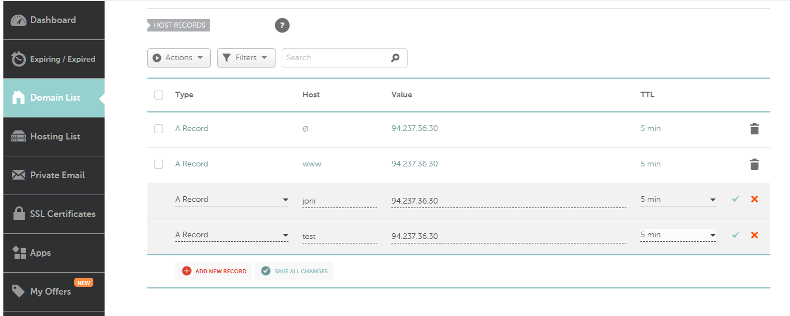

## e) Tutki jonkin nimen DNS-tietoja 'host' ja 'dig' -komennoilla. Käytä kumpaakin komentoa kaikkiin nimiin ja vertaa tuloksia. Katso man-sivulta, miten komennot toimivat - esimerkiksi miten 'dig' näyttää kaikki kentät. Analysoi tulokset, keskity nimipalvelimelta tulleisiin kenttiin (dig näyttää paljon muutakin tietoa). Etsi tarvittaessa uusia lähteitä haastaviin kohtiin. Sähköpostin todentamiseen liittyvät SPF ja DMARC -tietojen yksityiskohdat on jätetty vapaaehtoiseksi lisätehtäväksi. Tutkittavat nimet:

o	Oma domain-nimesi. Vertaa tuloksia nimen vuokraajan (namecheap.com, name.com...) weppiliittymässä näkyviin asetuksiin.

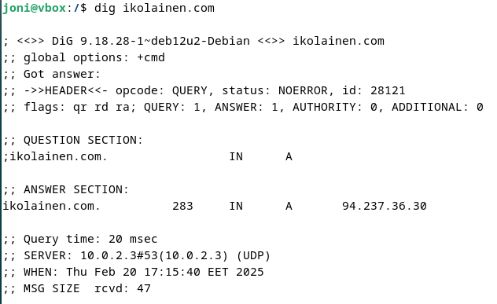

o	Jonkin pikkuyrityksen, kerhon tai yksittäisen henkilön weppisivut. (Ei kuitenkaan kurssikaverin tällä viikolla vuokrattua nimeä).

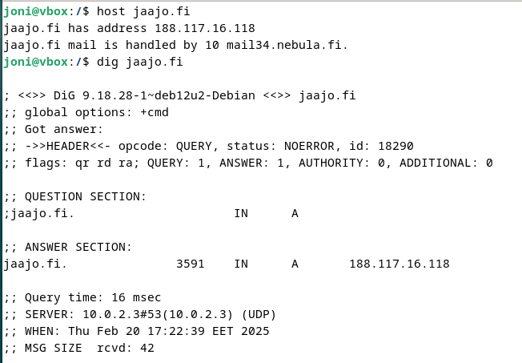

o	Jonkin suuren ja kaikkien tunteman palvelun tiedot.

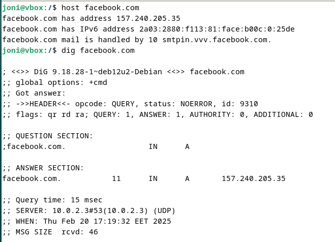

##  f) Vapaaehtoinen bonus: 

Aakkossalaattia sähköpostiin. Etsi palvelu, jonka DNS-tiedoissa on SPF ja DMARC.
Selitä näiden kenttien osat ja vaikutukset yksityiskohtaisesti. Voit halutessasi käyttää tulkinnan apuna jotain ohjelmaa tai palvelua, kunhan selität ja tulkitset lopputuloksen myös itse.

### SPF-haku:

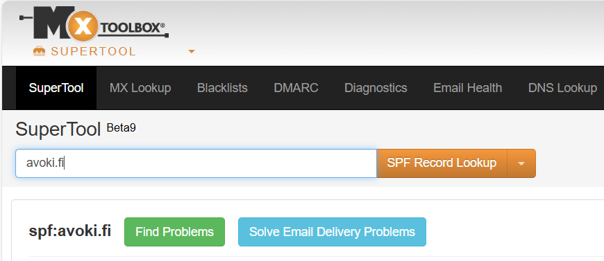

SPF-tietue:

`v=spf1 include:spf.protection.outlook.com include:mail.zendesk.com include:mailoutspf.cygrids.net -all`

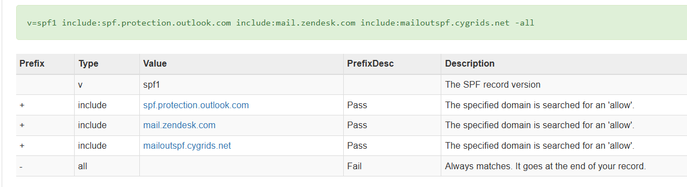

SPF-tietueen, eli Sender Policy Framen, tehtäv on määrittää palvelimet, jotka saavat käyttää domainia sähköpsotien lähettämiseen. 

**v=spf1**

SPF-tietueen versio.

**include:**

Tämän jälkeen aloitetaan luettelo sallituista palvelimista.

**spf.protection.outlook.com**

Sallii Outlookin.

**include:mail.zendesk.com**

Sallii Zendeskin.

**include:mailoutspf.cygrids.net**

Sallii Cygridsin.

**-all**

Päättää sallittujen palvelinten listan. Mikäli tämän jälkeen kirjoittaa uusia sallittuja palvelimia, eivät nämä saa lähetyslupaa.

### DMARC-haku:

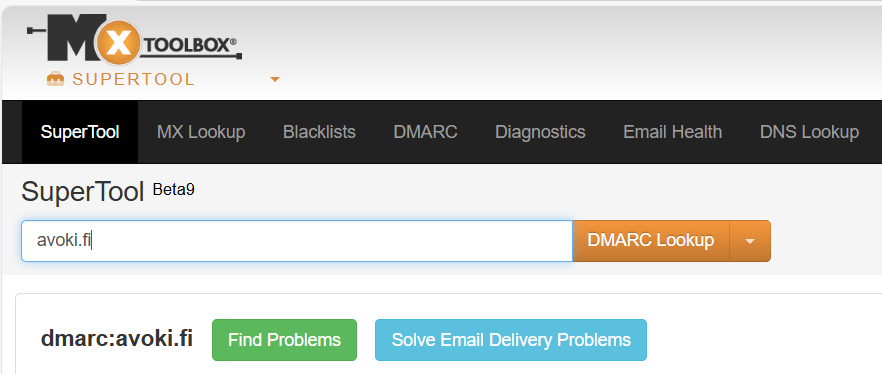

DMARC-tietue:

`v=DMARC1; p=none;`

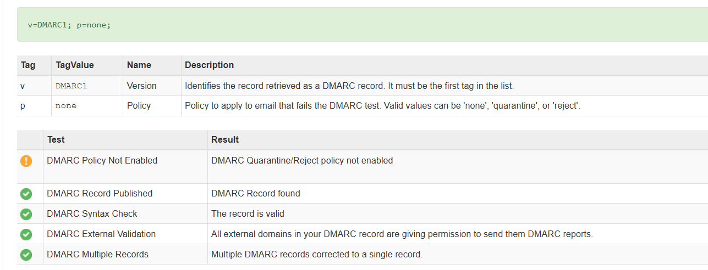

Tietue on kokonaisuudessaan tarkoitettu sähköpostin verkkotunnuksen suojaamiseen väärennöksiltä ja varmistamaan sähköpostin tunnistus oikeaksi lähettäjäksi vastaanottavan palvelimen puolella.

**v=DMARC1**

DMARC1 on DMARC-protokollan versio.

**p=none**

Määrittää, mitä epäonnistuneille viesteille tehdään. Tässä tapauksessa `none` kertoo, että ainoastaan raportit viesteistä kerätään, mutta muita erityisiä toimia ei suoriteta.


## Lähdeluettelo

- Tero Karvinen, Linux Palvelimet 2025: https://terokarvinen.com/linux-palvelimet/

- MXtoolbox (supertool): https://mxtoolbox.com/

- TNNet, Niko Niinijärvi 2024, DNS-hallinta - Mitä se on?: https://tnnet.fi/blogi/dns-hallinta-mita-se-on/

- CloudFlare, What are DMARC, DKIM, and SPF?: https://www.cloudflare.com/en-gb/learning/email-security/dmarc-dkim-spf/

- Host komento: https://linux.die.net/man/1/host

- Dig komento: https://linux.die.net/man/1/dig


## Tekijä

### Joni Laine

### Haaga-Helia, IT-Tradenomiopiskelija

Tätä dokumenttia saa kopioida ja muokata GNU General Public License (versio 2 tai uudempi) mukaisesti. (http://www.gnu.org/licenses/gpl.html)
