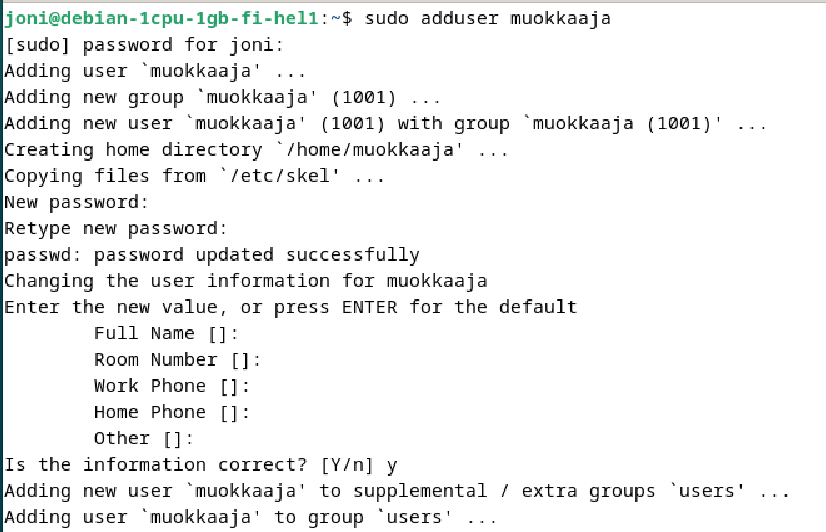
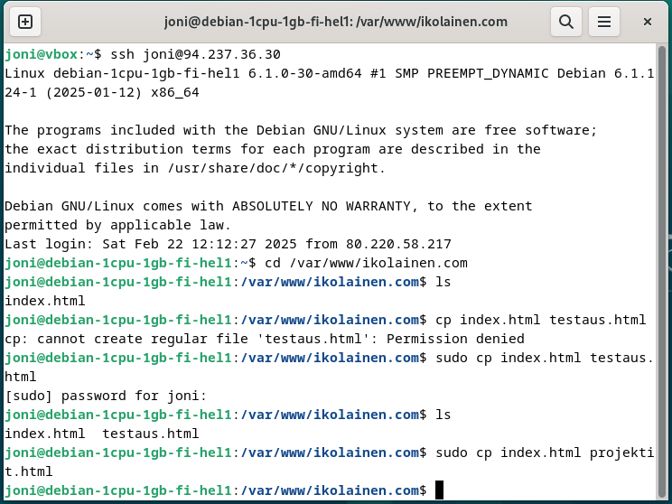

# h5 Nimekäs

Tässä osiossa luodaan oma weppi-sivusto omalle domainille sekä luodaan alasivustoja sekä alidomaineja sivustolle.
Huomioitavaa on, että osan kuvista jouduin ottamaan jälkitäteen uudestaan simuloidusti samasta tilanteesta, koska alkuperäisenä tekohetkenä otetut kuvat eivät enää löytyneet tai olivat jääneet tallentamatta alunperin. Osaan lokien aikaleimoista ei siis voi luottaa!

Aikaa kulunut: 0:00

## 	a) Julkinen nimi osoittamaan omaan koneeseen

Käytin oman domain-nimen hankintaan NameCheap-palvelua. Valitsin vapaan nimen ikonlainen.com ja lisäsin NameCheapin portaalissa kaksi A-tietuetta (`@`, eli juuri, sekä `www`, joka osoitti samaan IP-osoitteeseen kuin `@`-tietue). Käytetty IP-osoite, oli aiemmassa h4-tehtävässä toteuttamani IP varaamallani palvelimella.

Domainin DNS-tietueet näiden lisäysten jälkeen:


Vahvistin antamani yhteystiedot uudella domainilla NameCheapissa vaatimuksen mukaisesti. Tähän vaiheeseen pääsi helposti seuraamalla NameCheap-portaalin antamaa ilmoitusta seuraamalla.

A-tietueiden lisäämisen jälkeen oli juuri luomani domain ohjattu näyttämään aiemmin virtuaalikoneella luomani index.html ja ohjaus toimi sekä [ikolainen.com](http://ikolainen.com) että www.ikolainen.com osoitteilla:


Aikaa kulunut: 0:30

## b) Name Based Virtual Host näkyville uudessa nimessä

Kirjauduin virtuaalipalvelimelleni ja loin uuden käyttäjän sivujen muokkausta varten:



Loin uuden hakemiston ikolainen.com ja sisäsin omistajaoikeudet uudelle käyttäjälle `muokkaaja`.


Lopuksi annoin vielä tarvittavat oikeudet käyttäjälle `muokkaaja` ja tarkistin näiden olevan nyt oiekin sivuston muokkaamista varten:


Seuraavaksi loin nano-editorilla ikolainen.com.conf -tiedoston (käytin nanoa, koska micro-editor ei tukenut `copy-paste`-toimintoa hostin ja guestin välillä, ja konfigurointitiedosto oli valmiina kirjoitettuna host-koneellani):


Liitin host-koneella olevan sisällön guest-koneelle tiedostoon:

```
<VirtualHost *:80>
  ServerName ikolainen.com
  ServerAlias www.ikolainen.com
  DocumentRoot /var/www/ikolainen.com
  <Directory /var/www/ikolainen.com>
    Require all granted
  </Directory>
</VirtualHost>
```


Aktivoin sivun ja käynnistin uudestaan Apachen:

`$ a2ensite ikolainen.com.conf`

`$ sudo systemctl restart apache2`

Ja tarkistin selaimessa sivun tilanteen:


Päätin seuraavaksi luoda ikolainen.com sivustolle index.html -tiedoston.

`$ cd /var/www/`

`$ ls`

`$ cd ikolainen.com`

`$ ls`

`$ micro index.html`


Lisäsin HTML-sisältöä tiedostoon:


```
<!DOCTYPE html>
<html lang="fi">
<head>
    <meta charset="UTF-8">
    <title>Ikolainen-sivusto</title>
</head>
<body>
    <header>
        <h1>Tervetuloa etusivulle!</h1>
    </header>
    <body>
        <p>Tänne tulee sisältöä.</p>
    </body>
    <footer>
        <p>Tämä on Linux-palvelimet kurssille tehty sivusto.</p>
    </footer>
</body>
</html>
```

Tarkistin jälleen selaimessa sivuston päivitettyäni selaimen `shift` ja päivitä valinnoilla:


Aikaa kulunut 2:15

## c) Alasivujen luonti ja muokkaus näkyville nimellä

Siirryin takaisin ssh-yhteyteen ja oikeaan valikkoon:

`$ cd /var/www/ikolainen.com`

Kopioin index.html sivun kahdeksi erilliseksi html-sivuksi (testaus ja projektit):

`$ sudo cp index.html testaus.html`

`$ sudo cp index.html projektit.html`



Lisäsin index.html tiedostoon `nav`-osuuden:

`$ micro index.html`

```
<nav>
  <a href="testaus.html">Testaus</a>
  <a href="projektit.html">Projektit</a>
</nav>
```


Muokkasin testaus.html ja projektit.html tiedostot samalla tavalla siten, että sivut olivat tunnistettavissa helpommin toisistaan. Eli muokkasin kummankin tiedoston otsikkoa sekä `nav`-osiota kertomaan selvästi, mikä sivu oli kyseessä.

Tarkistin, että linkkiviittaukset sivustojen välillä toimivat selaimessa:


Aikaa kulunut: 2:45

## d) Alidomainien luonti omalle nimelle

Menin takaisin NameCheapin-portaaliin ja lisäsin kaksi vapaavalintaista alidomainia (testaus.ikolainen.com ja projektit.ikolainen.com), joille asetun saman TTL:n kuin juurisivulle ja www-tietueelle (5min). Päätin tehdä testaus.ikolainen.com sivusta A-tietueen ja projektit.ikolainen.com sivusta CNAME-tietueen:


Kokeilin kummankin alidomainin ohjaavan sivustoni etusivulle selaimessa.

Aikaa kulunut: 2:55

## e) Nimien DNS-tietojen tutkiminen 'host' ja 'dig' -komennoilla sekä tulosten vertailu. Komentojen toiminta käyttäen man-sivua lähteenä. Tulosten analysointi keskittyen DNS:ään liittyviin tietoihin.

**Tutkittavat nimet:**

**-	Oma domain-nimi.**


- `A`-tietue (ANSWER SECTION) näyttää IP-osoitteen, johon ikolainen.com viittaa

Haussa `$ dig ikolainen.com` näkyi myös viittaus sähköpostipalvelimeen, joten hain vielä näkyviin MX-tietueet erikseen haulla `$ dig ikolainen.com MX`:


Samalla tavalla olisi mahdollista hakea myös muita teituetietoja, kuten CNAME, TXT jne.

**-	Jonkin pikkuyrityksen, kerhon tai yksittäisen henkilön weppisivut.**

Käytin hakuun Jaajo Linnomaan sivua jaajo.fi:


Hauilla löytyi sivuston IP-osoite `A`-tietueena. Hain myös erikseen `MX`-tiedot ja löysin CNAME muodossa tiedot viitaten Hugedomains.com:iin sekä AmazonAWS:ään:


`SOA`-tietueesta selvisi, että DNS-palvelut ovat kyseisellä domainilla Amazonissa.

**- Jonkin suuren ja kaikkien tunteman palvelun tiedot.**

Käytin hakuun facebook.com sivua:


Jälleen IP-osoite oli saatavilla `host`-komennolla sekä `A`-tietueen tiedoissa.

`MX`-tietueesta löytyi minulle yllättävä uusi tieto, että Facebookilla on oma sähköpostipalvelimensa käytössä.


Aikaa kulunut: 3:45

##  f) Vapaaehtoinen bonus: 

Aakkossalaattia sähköpostiin. Etsi palvelu, jonka DNS-tiedoissa on SPF ja DMARC.
Selitä näiden kenttien osat ja vaikutukset yksityiskohtaisesti. Voit halutessasi käyttää tulkinnan apuna jotain ohjelmaa tai palvelua, kunhan selität ja tulkitset lopputuloksen myös itse.

### SPF-haku:


SPF-tietue:

`v=spf1 include:spf.protection.outlook.com include:mail.zendesk.com include:mailoutspf.cygrids.net -all`


SPF-tietueen, eli Sender Policy Framen, tehtäv on määrittää palvelimet, jotka saavat käyttää domainia sähköpsotien lähettämiseen. 

**v=spf1**

SPF-tietueen versio.

**include:**

Tämän jälkeen aloitetaan luettelo sallituista palvelimista.

**spf.protection.outlook.com**

Sallii Outlookin.

**include:mail.zendesk.com**

Sallii Zendeskin.

**include:mailoutspf.cygrids.net**

Sallii Cygridsin.

**-all**

Päättää sallittujen palvelinten listan. Mikäli tämän jälkeen kirjoittaa uusia sallittuja palvelimia, eivät nämä saa lähetyslupaa.

### DMARC-haku:


DMARC-tietue:

`v=DMARC1; p=none;`


Tietue on kokonaisuudessaan tarkoitettu sähköpostin verkkotunnuksen suojaamiseen väärennöksiltä ja varmistamaan sähköpostin tunnistus oikeaksi lähettäjäksi vastaanottavan palvelimen puolella.

**v=DMARC1**

DMARC1 on DMARC-protokollan versio.

**p=none**

Määrittää, mitä epäonnistuneille viesteille tehdään. Tässä tapauksessa `none` kertoo, että ainoastaan raportit viesteistä kerätään, mutta muita erityisiä toimia ei suoriteta.

Aikaa kulunut: 4:30

## Lähdeluettelo

- Tero Karvinen, Linux Palvelimet 2025: https://terokarvinen.com/linux-palvelimet/

- MXtoolbox (supertool): https://mxtoolbox.com/

- TNNet, Niko Niinijärvi 2024, DNS-hallinta - Mitä se on?: https://tnnet.fi/blogi/dns-hallinta-mita-se-on/

- CloudFlare, What are DMARC, DKIM, and SPF?: https://www.cloudflare.com/en-gb/learning/email-security/dmarc-dkim-spf/

- Host komento: https://linux.die.net/man/1/host

- Dig komento: https://linux.die.net/man/1/dig


## Tekijä

### Joni Laine

### Haaga-Helia, IT-Tradenomiopiskelija

Tätä dokumenttia saa kopioida ja muokata GNU General Public License (versio 2 tai uudempi) mukaisesti. (http://www.gnu.org/licenses/gpl.html)
