# h6 Salataampa

Tässä osiossa luodaan SSL-salaus (hhtps) weppisivustolle.

Aikaa kulunut: 0:00

## x) Lue ja tiivistä. Tiivistelmäksi riittää muutama ranskalainen viiva per artikkeli. (Tässä alakohdassa ei tarvitse tehdä testejä tietokoneella)

## a) Let's. Hanki ja asenna palvelimellesi ilmainen TLS-sertifikaatti Let's Encryptilta. Osoita, että se toimii.

Asennetaan Lego ja sille kansio.

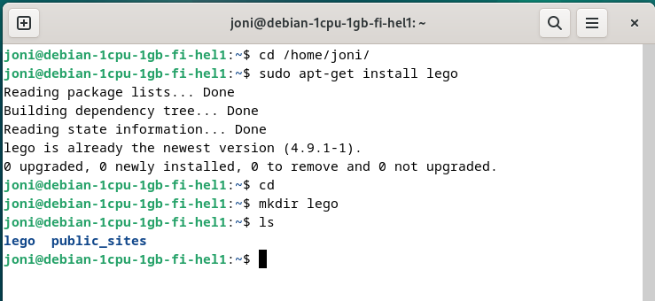

Testiympäristö SSL-sertifikaatille.

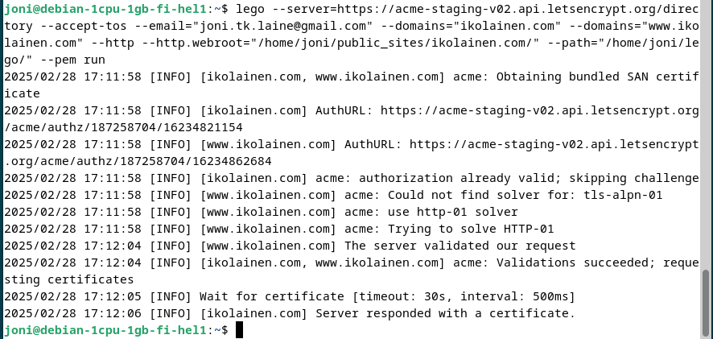

Toimii. Nyt voin kokeilla poistaa tämän testiversion:

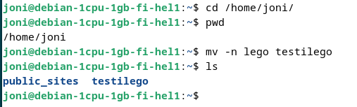

Ja latasin oikean SSL-sertifikaatin.

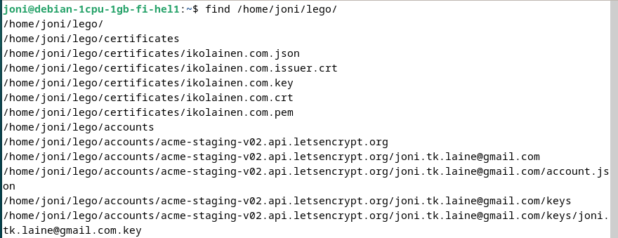

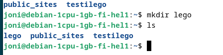

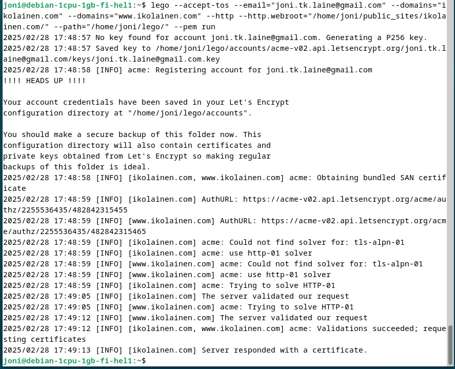

lego --accept-tos --email="joni.tk.laine@gmail.com" --domains="ikolainen.com" --domains="www.ikolainen.fi" --http --http.webroot="/home/joni/public_sites/ikolainen.com/" --path="/home/joni/lego/" --pem run

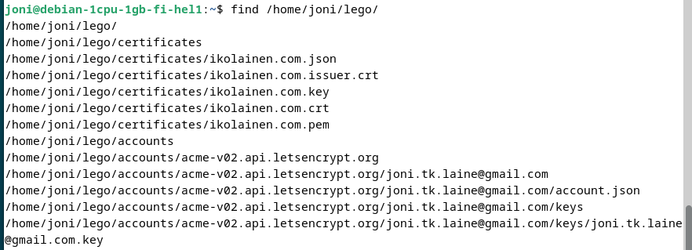

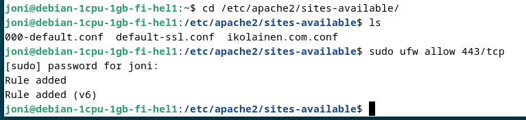

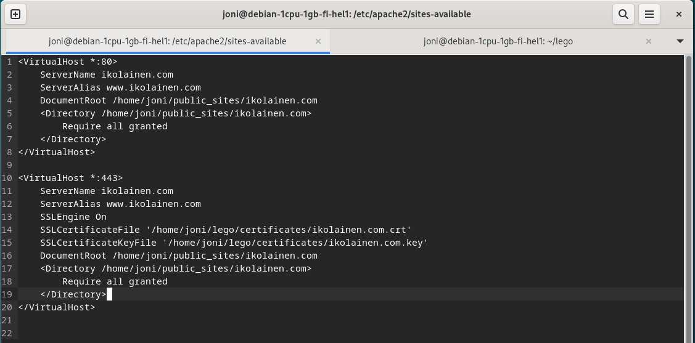

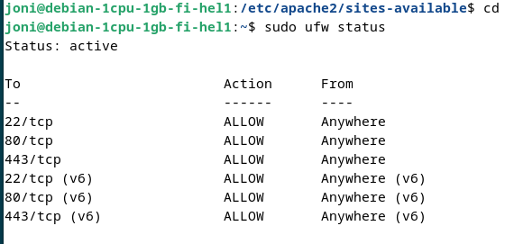

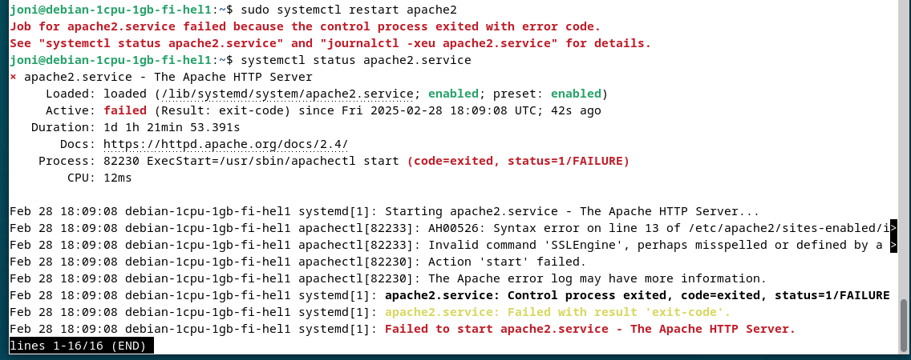

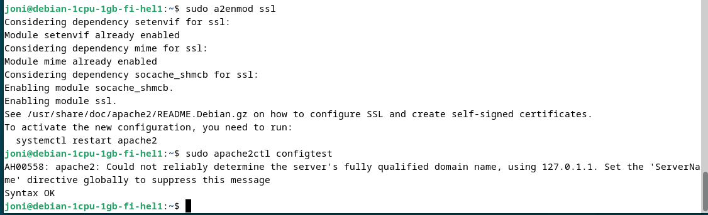

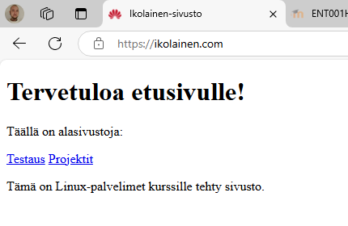

## b) A-rating. Testaa oma sivusi TLS jollain yleisellä laadunvarmistustyökalulla, esim. SSLLabs (Käytä vain tavanomaisia tarkistustyökaluja, ei tunkeutumistestausta eikä siihen liittyviä työkaluja)

## c) Vapaaehtoinen: Tee weppilomake, jossa on käyttäjätunnus ja salasana. Käytä salaamatonta http-yhteyttä. Sieppaa liikennettä (esim. Wireshark, ngrep). Mitä havaitset? Mitä vaikutuksia tällä on tietoturvaan?

## Lähdeluettelo

- Tero Karvinen, Linux Palvelimet 2025: https://terokarvinen.com/linux-palvelimet/

## Tekijä

### Joni Laine

### Haaga-Helia, IT-Tradenomiopiskelija

Tätä dokumenttia saa kopioida ja muokata GNU General Public License (versio 2 tai uudempi) mukaisesti. (http://www.gnu.org/licenses/gpl.html)

