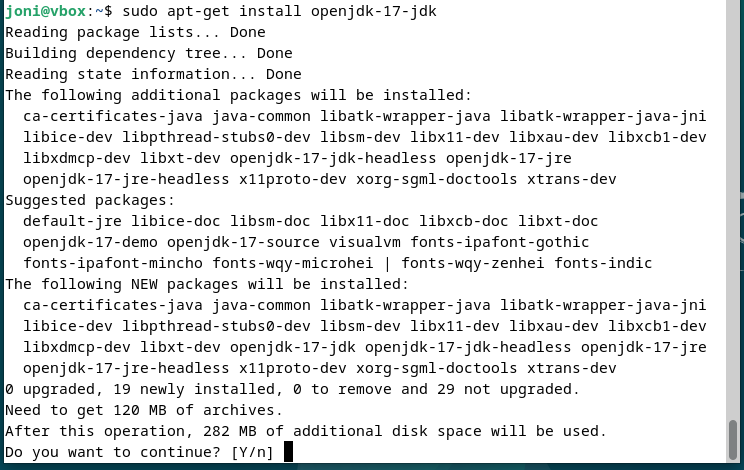
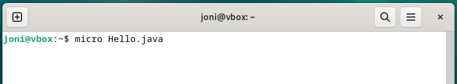
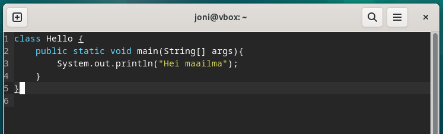
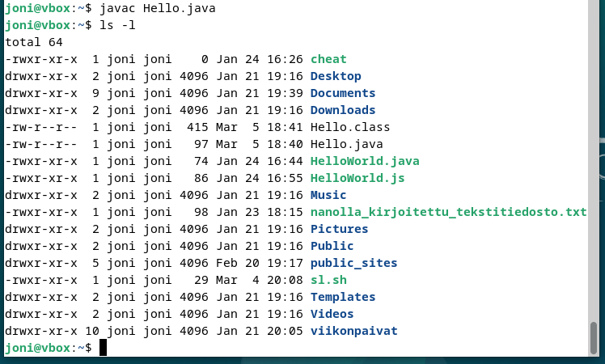
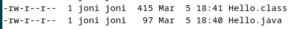
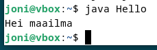

# h7 Maalisuora

## a) Kirjoita ja aja "Hei maailma" kolmella kielellä.

Aloitin valitsemalla kieliksi Javan, Pythonin ja 

Asensin ensimmäisenä virtuaalikoneen käyttäjälle Java Development Kit (JDK) -paketin komennolla:

`$ sudo apt-get install openjdk-17-jdk`

Asennuksessa kysytään vahvistusta, johon vastasin `y` ja `Enter`.

Asennus vei jonkin aikaa. Omalla koneellani noin 30 sekuntia.



Loin Hello.java tiedoston micro-editorilla komennolla:

`$ micro Hello.java`



Kirjoitin tiedoston sisälle lyhyen Hei maailma -javaskriptin. Huomioitavaa on, että luokan (class) nimi tulee olla sama kuin tiedoston nimi:

```
class Hello {
  public static void main(String[] args){
    System.out.println("Hei maailma");
  }
}
```



Tallensin skriptitiedoston ja suljin tämän.
Muutin Hello.java luettavaan muotoon java-tulkille komennolla:

`$ javac Hello.java`

Ja tarkistin tässä kohtaa käyttöoikeudet:

`$ ls -l`





Nämä näyttivät olevan kunnossa, jotta voisin suorittaa juuri tehdyn Hello.java skriptin. Annoin komennon kokeillakseni tätä:



Tämä toimi hienosti, joten siirryin Pythonin pariin.
  
## b) Lähdeviitteet. Tarkista ja tarvittaessa lisää lähdeviitteet kaikkiin raportteihisi h1 alkaen.
Tarkista, että olet viitannut lähteisiin: tehtäväsivuun, kurssiin, muiden opiskelijoiden raportteihin, man-sivuihin, kotisivuihin ja ylipäänsä kaikkiin käyttämiisi lähteisiin. 
  Lähdeviite tulee olla jokaisessa raportissa tai sivussa, jossa lähdettä on käytetty. Kaikki tehtävät perustuvat tämän sivun tehtävänantoihin, joten ainakin tämä viite on syytä löytyä. (Tästä alakohdasta ei tarvitse kirjoittaa vaiheittaista raporttia)


## c) Laita Linuxiin uusi, itse tekemäsi komento niin, että kaikki käyttäjät voivat ajaa sitä.

## d) Ratkaise vanha arvioitava laboratorioharjoitus soveltuvin osin.

## e) Asenna itsellesi tyhjä virtuaalikone arvioitavaa labraa varten. Suosittelen Debian 12-Bookworm amd64, riittävästi RAM ja kovalevyä. Koneella saa olla päivitetyt ohjelmistot (apt-get dist-upgrade), tulimuuri (esim. ufw). 
Koneella ei saa olla mitään muita demoneja tai ohjelmia asennettuna kuin nuo ja asennuksen mukana tulevat. Virtuaalikoneella ei saa olla luottamuksellisia tiedostoja, koska opettaja saattaa tarkastella sitä. 
(Tästä d-osioista ei tarvitse kirjoittaa raporttia. 
  Tavalliseen käyttöjärjestelmän asennuksen yhteydessä tulevat ohjelmat saavat olla mukana, esim. graafinen työpöytä tulee yleensä asennuksen mukana.)


## Lähdeluettelo

- Tero Karvinen, Linux Palvelimet 2025: https://terokarvinen.com/linux-palvelimet/


## Tekijä

### Joni Laine

### Haaga-Helia, IT-Tradenomiopiskelija

Tätä dokumenttia saa kopioida ja muokata GNU General Public License (versio 2 tai uudempi) mukaisesti. (http://www.gnu.org/licenses/gpl.html)
