# h7 Maalisuora

Huomioitavaa: raportissa on käytetty aikaa pituusmääreenä virheellisesti kellonajan ja päivämäärän sijaan.

Tässä osiossa luodaan kolmella ohjelmointikielellä tiedostot, sekä suoritetaan nämä tiedostot. Lisäksi luodaan oma komento, jonka kaikki koneella olevat käyttäjät pystyvät suorittamaan.

Aikaa kulunut: 0:00

## a) Kirjoita ja aja "Hei maailma" kolmella kielellä.

Aloitin valitsemalla ohjelmointikieliksi Javan, Pythonin ja C:n. Nämä valikoituivat käytettäviksi kieliksi, koska kaikista edellämainituista itselläni oli kokemusta ohjelmoinnissa vähintään alkeiden verran.

Asensin ensimmäisenä virtuaalikoneen käyttäjälle Java Development Kit (JDK) -paketin, koska pakettia tarvitsee Java-sisällön käsittelyyn:

`$ sudo apt-get install openjdk-17-jdk`

Asennuksessa kysytään vahvistusta, johon vastasin `y` ja `Enter`.

Asennus vei jonkin aikaa. Omalla koneellani noin 30 sekuntia.


Loin Hello.java tiedoston micro-editorilla komennolla:

`$ micro Hello.java`


Kirjoitin tiedoston sisälle lyhyen Hei maailma -javaskriptin. Huomioitavaa on, että luokan (class) nimi tulee olla sama kuin tiedoston nimi:

```
class Hello {
  public static void main(String[] args){
    System.out.println("Hei maailma");
  }
}
```


Tallensin skriptitiedoston ja suljin tämän.
Muutin Hello.java luettavaan muotoon java-tulkille komennolla:

`$ javac Hello.java`

Ja tarkistin tässä kohtaa käyttöoikeudet:

`$ ls -l`


Nämä näyttivät olevan kunnossa, jotta voisin suorittaa juuri tehdyn Hello.java skriptin. Annoin komennon kokeillakseni tätä:


Tämä toimi hienosti, joten siirryin Pythonin pariin.

Aikaa kulunut: 0:20

Lähdin asentamaan Pythonin-tulkkia, mutta muistin komennon annon jälkeen tehneeni tämän jo luennon aikana edeltävänä päivänä tauon aikana:

`$ sudo apt-get install python3`


Loin Python-kielellä lyhyen Hello.python -skriptin komennolla:

`$ micro Hello.python`


Ja sisällöksi koodin:

```
print("Hei maailma")
```


Tarkistin käyttöoikeudet tässä välissä luodulle tiedostolle (kuvassa alimmainen uusi tiedosto):


Oikeudet olivat kunnossa, joten kokeilin skriptin toiminnan:

`$ python3 Hello.python`


Tämäkin toimi hienosti, joten siirryin C-kielen pariin.

Aikaa kulunut: 0:30

Aloitin asentamalla C-kielen vaatiman paketin (GNU Compiler Collection) virtuaalikoneelle:

`$ sudo apt-get install gcc`

Annoin salasanan ja huomasin, että paketti oli jo asennettu virtuaalikoneelle ja vielä käyttäjän (itseni) toimesta. En muistanut syytä, miksi olisin tämän asentanut aiemmin koneelle jo valmiiksi, mutta uudelleen asentamisen yrittämisestä ei toisaalta ollut haittaakaan.


Loin C-kielen skriptin komennolla:

`$ micro Hello.c`


Ja sisällöksi yksinkertaisen koodin:

```
`$ #include <stdio.h>

int main() {
  printf("Hei maailma");
  return 0;
}
```


Tallensin ja suljin tiedoston ja tarkistin jälleen käyttöoikeudet:


Oikeudet olivat jälleen kunnossa, joten kokeilin tiedoston ajamista:


Huomasin, että C-kielen tulkki ei tunnistanut tai pystynyt lukemaan skriptiä, joten käänsin tiedoston tulkille sopivaan luettavaan muotoon ja nimesin se uudestaan Hello-nimiseksi:

`$ gcc Hello.c -o Hello`

Ja tarkistin lopputuloksen:

`$ ls -l`


C-kieli vaati toimiakseen myös x-oikeudet erikseen. Nämä olivat nyt kunnnossa, joten kokeilin ajaa tehdyn skriptin tällä kertaa viittaamalla suoraan käännettyyn kooditiedostoon:

`$ ./Hello`


Komento toimi, mutat antoi hieman sottaisen tulostusjäljen, joten lisäsin vielä tiedostoon puuttuvan rivivaihdon loppuun avaamalla alkuperäisen Hello.c tiedoston uudestaan micro-editorissa:

`$ micro Hello.c`

Ja lisäsin koodiin tarvittavan `\n`:

```
`$ #include <stdio.h>

int main() {
  printf("Hei maailma\n");
  return 0;
}
```


Käänsin Hello.c tiedoston uudestaan C-tulkille ja kokeilin ajaa skriptin uudestaan:

`$ gcc Hello.c -o Hello`

`$ ./Hello`


Nyt lopputulos oli siistimpi ja toimi hyvin.

Aikaa kulunut: 0:50
  
## b) Lähteiden tarkistus. Ei erikseen raportoitava.

Aikaa kulunut: 1:20

## c) Laita Linuxiin uusi, itse tekemäsi komento niin, että kaikki käyttäjät voivat ajaa sitä.

Etsin ensin jonkin hauskalta vaikuttavan ohjelman, jonka lisäsin skriptiini muutaman peruskomennon lisäksi. 
Päädyin kokeilemaan löytämääni `fortune`-ohjelmaa, joka kertoisi satunnaisia viisauksia, ennustuksia ja vastaavia.
Asensin ohjelman komennolla:

`$ sudo apt-get install fortune`

Ja vahvistin asennuksen valinnalla `y` + `Enter`.


Loin micro-editorilla oman skriptin nimeltä "omakomento":

`$ micro omakomento`


Ja lisäsin äsken asennetun fortunen sekä myös sisäänrakennetut `whoami` ja `uptime` -ohjelmat:

```
#!/usr/bin/bash

fortune

whoami

uptime
```


Skriptin alussa oleva #! (shebang tai hashbang) määrittää, että skriptin suorittamiseen käytetään `bash`-tulkkia ja tätä voivat käyttää myös muut käyttäjät, vaikka heillä ei olisi asennettuna bash-tulkkia itselleen.

Kokeilin tekemäni skriptin toimintaa (kuvassa ensimmäisessä komennossa minulla kävi virhe ja käytin takakenoa ensin kauttamerkin sijaan):

`$ ./omakomento`

Sain ilmoituksen käyttöoikeuksien puutteesta, joten tarkistin nämä:

`$ ls -l`


Kyseisen tiedoston käyttöoikeudet eivät riittäneet, eikä omalla käyttäjälläni ollut suoritus (`x`) oikeuksia:


Lisäsin suoritusoikeudet kaikille käyttäjille kyseiseen tiedostoon:

`$ chmod ugo+x /home/joni/omakomento`

Ja tarkistin näiden olevan nyt oikein:

`$ ls -l`


Nyt käyttöoikeudet olivat oikein määritetty, joten kopioin tiedoston hakemistoon `/usr/local/bin/` :

`$ sudo cp -v omakomento /usr/local/bin/`


Siirryin kotihakemistoon ja kokeilin ajaa juuri tehdyn ohjelman:

`$ cd /var/`

`$ omakomento`


Sain hienosti ohjelman toimimaan ja näkyville fortunen ennustuksen, oman käyttäjänimeni sekä koneen käynnissäoloajan.
Seuraavaksi lähdin kokeilemaan, että muut käyttäjät pystyvät myös ajamaan ohjelman. Koska minulla ei ollut valmiina koneella toista käyttäjää, loin tätä varten uuden etstikäyttäjän:

`$ sudo adduser testi`

Valitsin salasanan uudelle käyttäjälle ja annoin testiä varten tarvittavat tiedot.

Tein turhan komennon tässä välissä (`$ users`), mutta huomasin ajatusvirheen vasta seuraavassa vaiheessa.

Lisäsin testi-käyttäjän käyttäjäryhmään, toistin yllämainitun turhan komennon `$ users`, ja tarkistin testi-käyttäjän nyt näkyvän ryhmässä:

`$ sudo usermod -aG users testi`

`$ groups testi`


Kirjauduin luodulle testi-käyttäjälle, siirryin oikeaan hakemistoon ja kokeilin ajaa tällä käyttäjällä tekemääni ohjelmaa:

`$ su - testi`

`$ cd /var/`

`$ omakomento`


Hienosti toimi. (Ja myös fortunen antama ennuste mahdollisuudesta edetä tänään osui oikeaan ainakin tässä tehtävässä.)

Aikaa kulunut: 1:50

## d) Ratkaise vanha arvioitava laboratorioharjoitus soveltuvin osin.

a) https://terokarvinen.com/2024/arvioitava-laboratorioharjoitus-2024-linux-palvelimet/
- Joni Laine
- 2408717
- https://github.com/JoniLaine/linux-palvelimet

b) Tiivistelmä koko työstä lopuksi
- Vastaa tähän kohtaan aivan viimeisenä

c) Ei kolmea sekoseiskaa

Valitettavasti en ymmärtänyt tehtävänantoa. Raportti on kirjoitettu GitHubiin, joka on avoinna kaikille ollessaan public-julkaisu.

d) howdy

Lähdin tekemään "howdy"-nimistä komentoa, joka olisi kaikkien käyttäjien ajettavissa:

`$ micro howdy`


Lisäsin sisällön ja hashbangin:

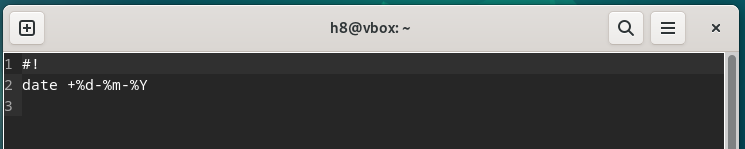

Ja kokeilin ajaa komennon omalla käyttäjälläni:


Tämä toimi joten lisäsin myös kaikille muille käyttäjille `x`-oikeudet:

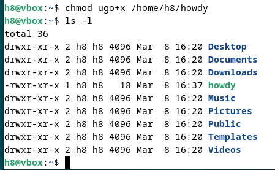

Kopioin tiedoston hakemistoon, johon muut käyttäjät pääsevät käsiksi ja kirjauduin testikäyttäjälle kokeillakseni sen toimivan myös testi-käyttäjän ajaessa tiedoston:

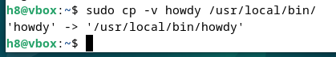

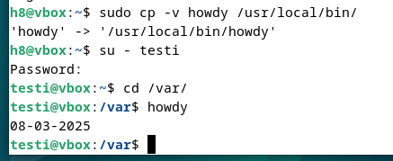

Asensin Apache2 virtuaalikoneelle:

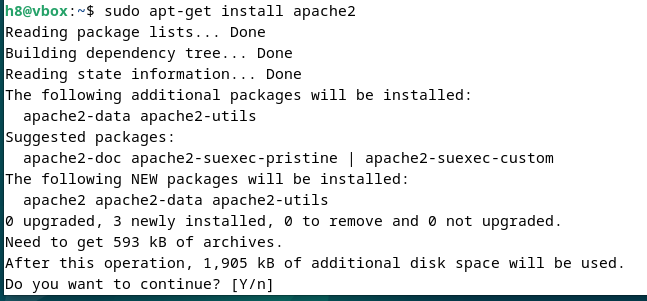

Loin public-sites hakemiston ja sinne tiedoston AIKakone.com:

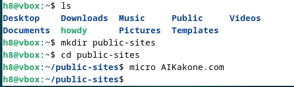

Otin sivun käyttöön:

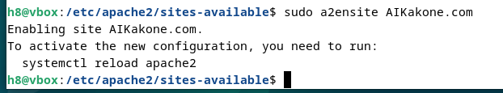

Otin pois aktiivisista sivustoista default-sivun:

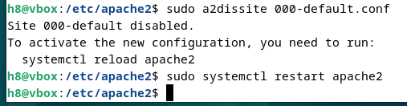

Kokeilin avata sivun osoitteesta http://localhost:

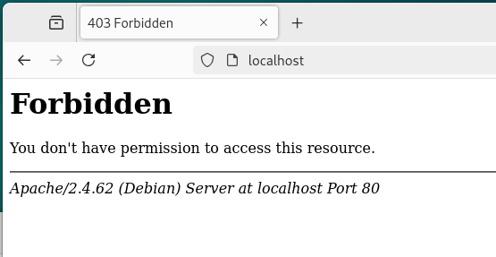

Virhe antoi ylläolevan, mutta tiesin, että sivulla ei ole sisältöä joten loin seuraavan tiedoston:

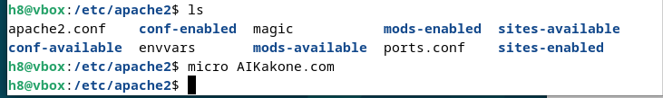

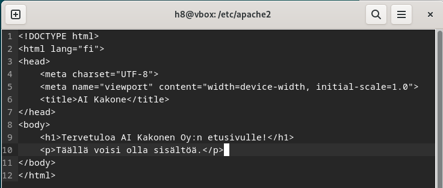

Latasin sivun uudestaan ja tarkistin lokitiedot:

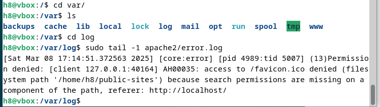

Loin konfiguraatiotiedoston alla olevilla spekseillä, mutta sijainto oli luultavasti väärä:

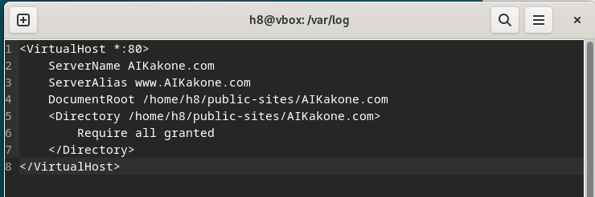

Käynnistin apachen uudestaan, avasin selaimen uudestaan ja tarkistin virhelokin:


Kävin tarkistamassa käyttöoikeudet ja huomasin että x-oikeudet puuttuivat, joten lisäsin ne:

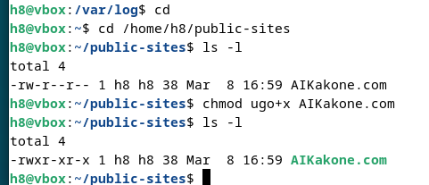

Kokeilin jälleen avata sivun selaimessa uudestaan ja sain saman virheen, joten luin virhelokin ja lisäsin koko polkuun x-oikeudet kaikille käyttäjille:

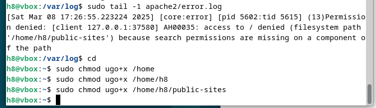

Sivu ei edelleenkään toiminut, joten päätin tehdä tällä välin uuden käyttäjän koneelle ja antaa käyttäjälle muokkausoikeudet ilman sudoa tekemälleni etusivulle:

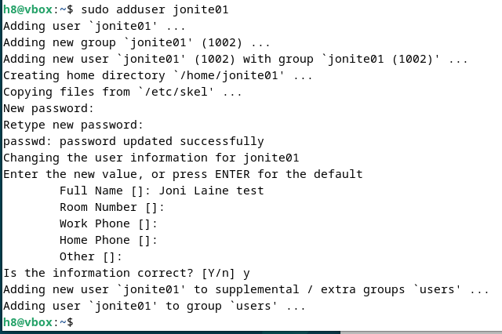

Tälläkään ei ollut vaikutusta. Saadut virheet eivät itselleni oikein avautuneet, mutta luultavasti nämä saan joskus ajan kanssa selvitettyä paremmin. Tältä erää toteutus ei onnistunut ja epämääräiset virheilmoitukset puuttuvista poluista yms. eivät tuoneet juurikaan iloa, koska hakemisto oli olemassa mielestäni.

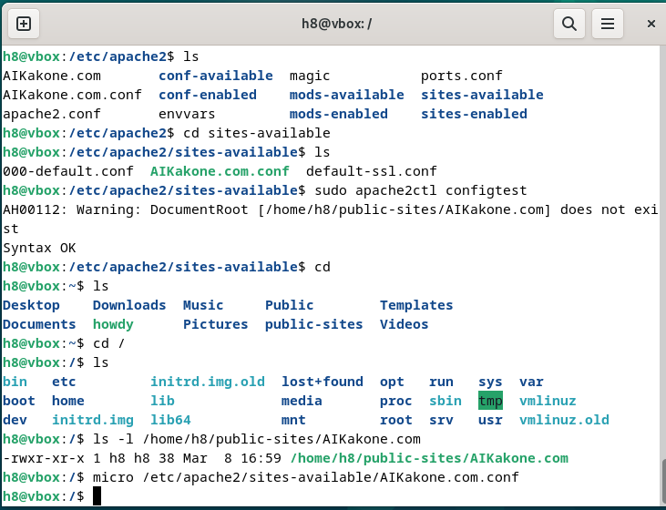

Kokeilin kuitenkin huvikseni vielä tarkistaa asian ja tällöin havaitsin, ett olin vahingossa luonut tiedoston enkä hakemistoa:

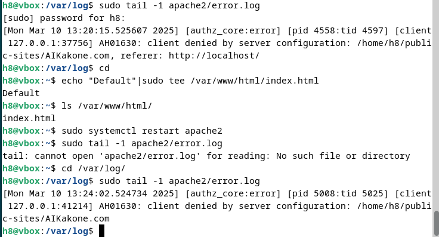

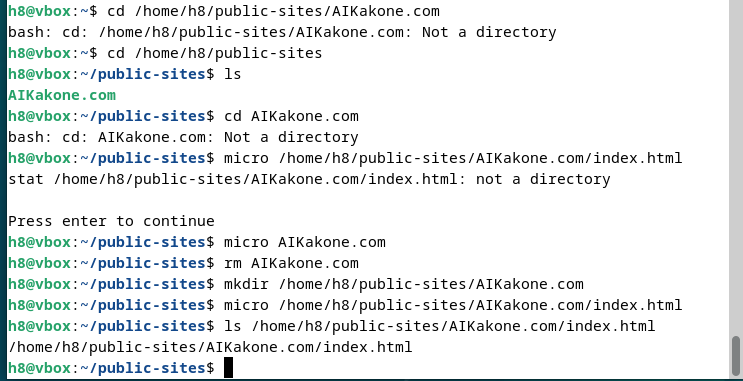

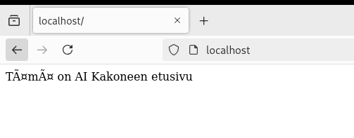

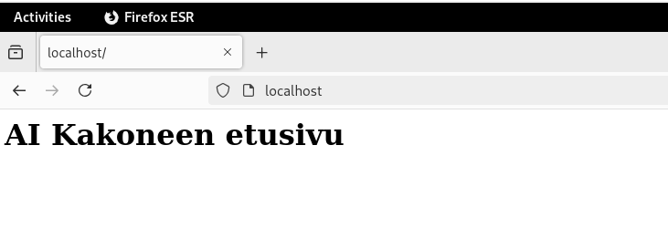

Aikaa kulunut: 5:45

## e) Asenna itsellesi tyhjä virtuaalikone arvioitavaa labraa varten. Suosittelen Debian 12-Bookworm amd64, riittävästi RAM ja kovalevyä. Koneella saa olla päivitetyt ohjelmistot (apt-get dist-upgrade), tulimuuri (esim. ufw). 
Koneella ei saa olla mitään muita demoneja tai ohjelmia asennettuna kuin nuo ja asennuksen mukana tulevat.
Tästä osiosta ei ole erillistä raporttia.


## Lähdeluettelo

- Tero Karvinen, Linux Palvelimet 2025: https://terokarvinen.com/linux-palvelimet/
- Ask Ubuntu: https://askubuntu.com/questions/831/what-does-it-mean-that-a-package-is-set-to-manually-installed
- Tero Karvinen, Shell Scripting: https://terokarvinen.com/2007/12/04/shell-scripting-4/
- Oman skriptin tekoon etsitty ohjelmavinki: https://medium.com/@gurpreet.singh_89/15-fun-linux-command-line-programs-to-spice-up-your-terminal-abf30af73de1
- Final lab: https://terokarvinen.com/2024/arvioitava-laboratorioharjoitus-2024-linux-palvelimet/
- Oma materiaali: https://github.com/JoniLaine/linux-palvelimet/tree/main
- Giang Lee: https://github.com/gianglex/Linux-palvelimet/blob/main/h3/h3-%20hello-web-server.md


## Tekijä

### Joni Laine

### Haaga-Helia, IT-Tradenomiopiskelija

Tätä dokumenttia saa kopioida ja muokata GNU General Public License (versio 2 tai uudempi) mukaisesti. (http://www.gnu.org/licenses/gpl.html)
