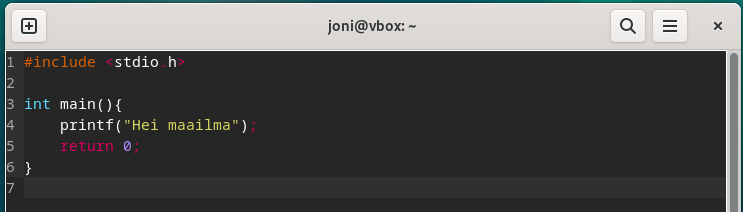

# h7 Maalisuora

Huomioitavaa: raportissa on käytetty aikaa pituusmääreenä virheellisesti kellonajan ja päivämäärän sijaan.

Tässä osiossa luodaan kolmella ohjelmointikielellä tiedostot, sekä suoritetaan nämä tiedostot. Lisäksi luodaan oma komento, jonka kaikki koneella olevat käyttäjät pystyvät suorittamaan.

Aikaa kulunut: 0:00

## a) Kirjoita ja aja "Hei maailma" kolmella kielellä.

Aloitin valitsemalla ohjelmointikieliksi Javan, Pythonin ja C:n. Nämä valikoituivat käytettäviksi kieliksi, koska kaikista edellämainituista itselläni oli kokemusta ohjelmoinnissa vähintään alkeiden verran.

Asensin ensimmäisenä virtuaalikoneen käyttäjälle Java Development Kit (JDK) -paketin, koska pakettia tarvitsee Java-sisällön käsittelyyn:

`$ sudo apt-get install openjdk-17-jdk`

Asennuksessa kysytään vahvistusta, johon vastasin `y` ja `Enter`.

Asennus vei jonkin aikaa. Omalla koneellani noin 30 sekuntia.


Loin Hello.java tiedoston micro-editorilla komennolla:

`$ micro Hello.java`


Kirjoitin tiedoston sisälle lyhyen Hei maailma -javaskriptin. Huomioitavaa on, että luokan (class) nimi tulee olla sama kuin tiedoston nimi:

```
class Hello {
  public static void main(String[] args){
    System.out.println("Hei maailma");
  }
}
```


Tallensin skriptitiedoston ja suljin tämän.
Muutin Hello.java luettavaan muotoon java-tulkille komennolla:

`$ javac Hello.java`

Ja tarkistin tässä kohtaa käyttöoikeudet:

`$ ls -l`


Nämä näyttivät olevan kunnossa, jotta voisin suorittaa juuri tehdyn Hello.java skriptin. Annoin komennon kokeillakseni tätä:


Tämä toimi hienosti, joten siirryin Pythonin pariin.

Aikaa kulunut: 0:20

Lähdin asentamaan Pythonin-tulkkia, mutta muistin komennon annon jälkeen tehneeni tämän jo luennon aikana edeltävänä päivänä tauon aikana:

`$ sudo apt-get install python3`


Loin Python-kielellä lyhyen Hello.python -skriptin komennolla:

`$ micro Hello.python`


Ja sisällöksi koodin:

```
print("Hei maailma")
```


Tarkistin käyttöoikeudet tässä välissä luodulle tiedostolle (kuvassa alimmainen uusi tiedosto):


Oikeudet olivat kunnossa, joten kokeilin skriptin toiminnan:

`$ python3 Hello.python`


Tämäkin toimi hienosti, joten siirryin C-kielen pariin.

Aikaa kulunut: 0:30

Aloitin asentamalla C-kielen vaatiman paketin (GNU Compiler Collection) virtuaalikoneelle:

`$ sudo apt-get install gcc`

Annoin salasanan ja huomasin, että paketti oli jo asennettu virtuaalikoneelle ja vielä käyttäjän (itseni) toimesta. En muistanut syytä, miksi olisin tämän asentanut aiemmin koneelle jo valmiiksi, mutta uudelleen asentamisen yrittämisestä ei toisaalta ollut haittaakaan.


Loin C-kielen skriptin komennolla:

`$ micro Hello.c`


Ja sisällöksi yksinkertaisen koodin:

```
`$ #include <stdio.h>

int main() {
  printf("Hei maailma");
  return 0;
}
```



Tallensin ja suljin tiedoston ja tarkistin jälleen käyttöoikeudet:


Oikeudet olivat jälleen kunnossa, joten kokeilin tiedoston ajamista:


Huomasin, että C-kielen tulkki ei tunnistanut tai pystynyt lukemaan skriptiä, joten käänsin tiedoston tulkille sopivaan luettavaan muotoon ja nimesin se uudestaan Hello-nimiseksi:

`$ gcc Hello.c -o Hello`

Ja tarkistin lopputuloksen:

`$ ls -l`


C-kieli vaati toimiakseen myös x-oikeudet erikseen. Nämä olivat nyt kunnnossa, joten kokeilin ajaa tehdyn skriptin tällä kertaa viittaamalla suoraan käännettyyn kooditiedostoon:

`$ ./Hello`


Komento toimi, mutat antoi hieman sottaisen tulostusjäljen, joten lisäsin vielä tiedostoon puuttuvan rivivaihdon loppuun avaamalla alkuperäisen Hello.c tiedoston uudestaan micro-editorissa:

`$ micro Hello.c`

Ja lisäsin koodiin tarvittavan `\n`:

```
`$ #include <stdio.h>

int main() {
  printf("Hei maailma\n");
  return 0;
}
```


Käänsin Hello.c tiedoston uudestaan C-tulkille ja kokeilin ajaa skriptin uudestaan:

`$ gcc Hello.c -o Hello`

`$ ./Hello`


Nyt lopputulos oli siistimpi ja toimi hyvin.

Aikaa kulunut: 0:50
  
## b) Lähteiden tarkistus. Ei erikseen raportoitava.

## c) Laita Linuxiin uusi, itse tekemäsi komento niin, että kaikki käyttäjät voivat ajaa sitä.

Asensin:


Hienosti toimi. (Ja myös fortunen antama ennuste mahdollisuudesta edetä tänään osui oikeaan ainakin tässä tehtävässä.)

## d) Ratkaise vanha arvioitava laboratorioharjoitus soveltuvin osin.

## e) Asenna itsellesi tyhjä virtuaalikone arvioitavaa labraa varten. Suosittelen Debian 12-Bookworm amd64, riittävästi RAM ja kovalevyä. Koneella saa olla päivitetyt ohjelmistot (apt-get dist-upgrade), tulimuuri (esim. ufw). 
Koneella ei saa olla mitään muita demoneja tai ohjelmia asennettuna kuin nuo ja asennuksen mukana tulevat. Virtuaalikoneella ei saa olla luottamuksellisia tiedostoja, koska opettaja saattaa tarkastella sitä. 
(Tästä d-osioista ei tarvitse kirjoittaa raporttia. 
  Tavalliseen käyttöjärjestelmän asennuksen yhteydessä tulevat ohjelmat saavat olla mukana, esim. graafinen työpöytä tulee yleensä asennuksen mukana.)


## Lähdeluettelo

- Tero Karvinen, Linux Palvelimet 2025: https://terokarvinen.com/linux-palvelimet/
- Ask Ubuntu: https://askubuntu.com/questions/831/what-does-it-mean-that-a-package-is-set-to-manually-installed
- Tero Karvinen, Shell Scripting: https://terokarvinen.com/2007/12/04/shell-scripting-4/
- Oman skriptin tekoon etsitty ohjelmavinki: https://medium.com/@gurpreet.singh_89/15-fun-linux-command-line-programs-to-spice-up-your-terminal-abf30af73de1


## Tekijä

### Joni Laine

### Haaga-Helia, IT-Tradenomiopiskelija

Tätä dokumenttia saa kopioida ja muokata GNU General Public License (versio 2 tai uudempi) mukaisesti. (http://www.gnu.org/licenses/gpl.html)
